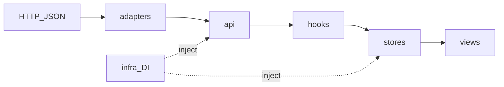

# CCD — Enterprise Vue 3 Architecture

> **本仓库代号 CCD**（npm 包名：`app-template`）— 一套以 **Vue 3 + PrimeVue + UnoCSS** 为核心、追求 **极致性能、类型安全与可维护边界** 的企业级后台管理前端架构模板。

<p align="center">
  
  
  
  
  
  
  
</p>

---

## Core Architecture

我们在前端侧对齐 **Clean Architecture** 与 **DDD** 的边界思想：不追求教科书式的全套战术模式，而是把 **依赖方向** 和 **脏数据隔离** 写进目录与规则里。

### Adapters（防腐层）

外部 HTTP 响应、存储回读等 **不可信数据** 在进入领域模型前，应在 `src/adapters` 收敛结构（例如 `parseSafeObject`），避免把 `unknown` 直接泄漏到业务层。业务代码以 **命名 DTO** 与 **Alova 方法构建器**（`src/api`）表达契约，在边界处完成校验与收窄。

### Infra（依赖注入）

`src/infra` 提供 **tokenProvider、路由只读桥** 等注入点，使 **HTTP 拦截器 ↔ Pinia ↔ Vue Router** 之间 **禁止循环 import**。401 刷新、登出与导航解耦由架构规则统一约束，业务模块只消费稳定 API。

### Directives（DOM 与交互隔离）

跨端手势（`v-tap`、`v-swipe`、`v-long-press`）与 **RBAC 鉴权**（`v-auth`）沉淀在 `src/directives`，组件内优先表达业务与展示，降低模板噪音与重复监听逻辑。



---

## Design System & Animation

- **Theme Engine**：设计令牌由 **CSS 变量** 驱动；**PrimeVue** 采用 Styled Mode 与全局/局部 **Pass Through (`pt`)** 映射到语义 Token；**UnoCSS** 侧由 `src/design-engine`（含 `semanticShortcuts` 等）维护 **可审计的快捷方式闭集**，避免原子类失控。
- **Glass & Surfaces**：玻璃态、材质与 Z 轴语义在 `.cursor/rules/design-system` 中有硬约束，保证暗色模式与主题切换下的可读性与性能底线。
- **Motion**：登录场景 **`animated-characters`** 使用 **GSAP** 驱动图腾式多角色场景（视差、眨眼、密码显隐姿态等），与布局坐标系解耦；全站 **Lottie** 经 `lottieThemeUtils` 与主题同步，加载器侧 **`vue3-lottie` 异步导入**，避免首屏被动画运行时拖垮。

---

## Ultimate Performance

以下为仓库内 **可指向源码** 的优化手段（非口号清单）：

| 能力                          | 说明                                                                                                                                                                                               |
| ----------------------------- | -------------------------------------------------------------------------------------------------------------------------------------------------------------------------------------------------- |
| **生产环境剔除 Example 路由** | `src/router/index.ts` 对 `./modules/example.ts` 使用 glob 排除；仅 `import.meta.env.DEV` 时合并示例路由，生产构建由死代码消除 + Rollup 摇树移除大块演示代码。                                      |
| **细粒度 manualChunks**       | `vite.config.ts` 将 `vue`/`vue-router`/`pinia`、`alova`/`vue-i18n`/`@vueuse`、**ECharts**、**GSAP**、**Lottie**、`@primeuix` 主题、工具库等拆入独立 vendor chunk，利于缓存与并行加载。             |
| **ECharts 额外摇树**          | `build/plugins.ts` 在构建期对 `echarts/lib` 下 `chart` 与 `component` 子路径增强 `moduleSideEffects: false`，配合按需注册，减小未用图表残留。                                                      |
| **Lottie 体积与运行时**       | `build/utils.ts` 将 `lottie-web` 指向 **light** 构建（无表达式引擎，显著减包）；`LoadingLottie.vue` 对 JSON **`fetch` + `Map` 缓存**；`BaseLottieLoader` **动态 import** `vue3-lottie`。           |
| **Gzip + Brotli**             | `vite-plugin-compression`（见 `build/compress.ts`）；通过环境变量 **`VITE_COMPRESSION`** 选择 `gzip` / `brotli` / **`both`**（生产建议在 `.env.production` 中设为 `both` 以产出双份预压缩资源）。  |
| **连接与首屏**                | `build/html.ts` 根据 **`VITE_API_BASE_URL`** 注入 **`preconnect` + `dns-prefetch`**；主题 fallback 样式注入减轻 FOIT。                                                                             |
| **静态资源**                  | 布局与业务广泛使用 **WebP** 位图；构建侧 `assetsInlineLimit`、**`treeshake.preset: 'smallest'`**、Vue SFC **`hoistStatic` / `cacheHandlers`**；生产可按 env 剔除 `debugger` 与大部分 `console.*`。 |

---

## DevOps & Open Source Workflow (工程化与自动化)

- **全自动发版引擎**：集成 Google **`release-please`**，基于 [Conventional Commits](https://www.conventionalcommits.org/) 规范，全自动计算 SemVer 版本号、打 Git Tag，并生成维护良好的 **`CHANGELOG.md`**。
- **依赖智能更新**：配置 **`dependabot`**，每周按需自动拉取依赖更新 PR，保持技术栈的前沿性与安全基线。
- **企业级主干保护**：**Husky** 与强约束 **CI**（Type-Check & Lint Guardian）协同 **GitHub 分支保护**，拦截带病代码合入 **`main`**。
- **开源社区规范**：内置 **Bug Report**、**Feature Request** 与 **Pull Request** 模板，规范化全球开发者的贡献流程。

---

## Project Structure

精简版 `src` 导览（完整模块见 `.cursor/rules` 与源码树）：

```text
src/
├── adapters/          # 防腐层：外部数据进入领域前的结构收敛
├── api/               # Alova 方法构建器（按模块/特性拆分，仅两层目录）
├── assets/            # 图标、图片、Lottie、全局样式
├── components/        # 全局业务组件（ProTable、ProForm、PrimeDialog、UseEcharts 等）
├── constants/         # 应用常量（路由、布局、主题名等）
├── design-engine/     # UnoCSS：tokens、shortcuts、safelist、校验
├── directives/        # 手势与鉴权等指令
├── hooks/             # 可复用组合式逻辑（含 layout、HTTP、图表主题等）
├── infra/             # DI：auth、router 等基础设施桥接
├── layouts/           # 布局壳（需显式 import，不参与自动注册）
├── locales/           # i18n 语言包
├── plugins/           # 应用插件入口
├── router/            # 路由模块与动态路由、守卫
├── stores/            # Pinia 模块
├── types/             # dto / systems / modules 等类型分层
├── utils/             # 工具（http、date、safeStorage、theme 等）
└── views/             # 页面视图（dashboard、login、example 等）
```

---

## Quick Start

**环境要求**（见 `package.json` 的 `engines`）：

- **Node.js** ≥ 24.3.0
- **pnpm** ≥ 10.0.0

仓库根目录未提供 `.env.example`；请基于团队约定或现有 **`.env` / `.env.development` / `.env.production`** 配置 `VITE_*` 变量（如 `VITE_API_BASE_URL`、`VITE_COMPRESSION`、`VITE_PUBLIC_PATH` 等）。

```bash
pnpm install
pnpm dev          # 本地开发
pnpm build        # 类型检查 + 生产构建
pnpm preview      # 预览 dist
pnpm build:analyze   # 构建并配合 analyze 模式（见脚本）
```

其他常用脚本：`pnpm type-check`、`pnpm lint`、`pnpm test` — 详见 `package.json` 的 `scripts`。

---

## 许可证

本项目采用 **GNU General Public License v3.0（GPL-3.0）** 开源协议。完整条款与副本说明请参阅项目根目录下的 [`LICENSE`](LICENSE) 文件。
