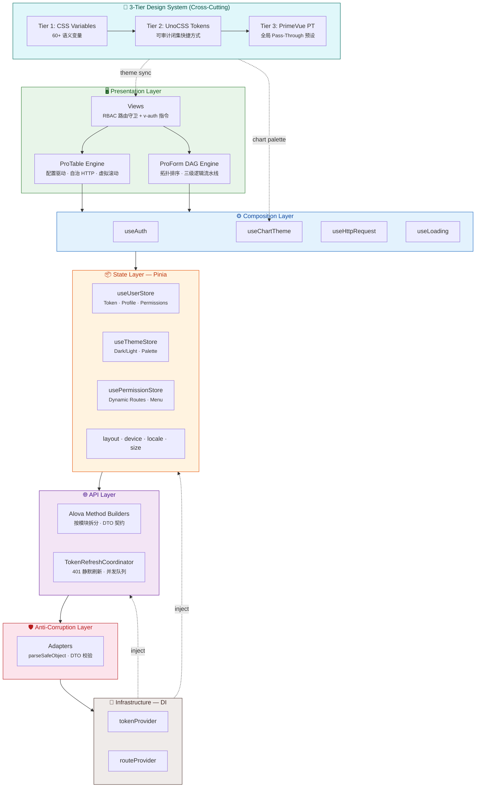

<div align="center">

# CCD — Enterprise Vue 3 Architecture

### 超越模板，重塑基建 —— 2026 世代企业级 Vue 3 中后台架构底座

<br />

[](https://vuejs.org/)
[](https://vite.dev/)
[](https://primevue.org/)
[](https://unocss.dev/)
[](https://www.typescriptlang.org/)
[](https://pinia.vuejs.org/)
[](https://echarts.apache.org/)

[](https://nodejs.org/)
[](https://pnpm.io/)
[](./LICENSE)
[](https://github.com/ichichuang/ccd/pulls)

<br />

**CCD** 不是又一个后台模板。它是一套以 **Clean Architecture + DDD 边界思想** 为骨架、以 **ProForm DAG 引擎** 和 **ProTable 低代码引擎** 为核心生产力、以 **三层零硬编码设计系统** 为视觉基座的 **企业级前端架构底座**。

[在线演示](https://ichichuang.github.io/ccd/) · [快速开始](#-快速开始) · [架构概览](#-架构拓扑) · [特性矩阵](#-核心特性矩阵)

</div>

---

## 📐 架构拓扑



> **数据流方向**：`HTTP → Adapters → API Builders → Hooks → Stores → Views`，**严禁反向依赖**。Infra 层通过 DI 注入打破 HTTP ↔ Pinia ↔ Router 的循环引用。

---

## 🚀 核心特性矩阵

### 🧠 ProForm DAG 引擎

> 告别回调地狱 —— 用**有向无环图**编排表单字段依赖

- **Kahn 拓扑排序** — 解析时自动检测循环依赖，运行时按安全顺序更新
- **三级逻辑流水线** — `DisableEngine → RequiredEngine → VisibilityEngine`，条件规则 (`disabledIf` / `requiredIf` / `visibleIf`) 响应式求值
- **碎片原子更新** — 50+ 互相依赖字段零手动编排，省 → 市 → 区 → 邮编自动级联
- **插件系统 + 状态持久化** — 可扩展的 Schema 驱动架构

### 📊 ProTable 低代码引擎

> 纯 Prop 声明 → 全自治表格，业务代码不碰 `ref(data)` / `ref(loading)`

- **配置驱动** — `:api` + `:columns` + `:data-key` 三行 Prop 即出完整 CRUD 表格
- **自治 HTTP** — 分页参数映射、错误重试 UI、竞态请求取消，全部内置
- **valueEnum 声明式渲染** — 枚举列自动 Tag/Badge，拒绝 render 函数膨胀
- **TanStack Virtual** — 万行级虚拟滚动 + 无限滚动双模式
- **URL 状态同步** — 筛选/排序/分页可书签化

### 🎨 三层零硬编码设计系统

> 整个仓库 **零 `#fff`、零 `text-red-500`、零裸 `rem`** —— 全量语义 Token

| 层级       | 载体                   | 职责                                                                           |
| ---------- | ---------------------- | ------------------------------------------------------------------------------ |
| **Tier 1** | CSS Custom Properties  | 60+ 语义变量（`--primary`, `--background`, `--sidebar-*`...）                  |
| **Tier 2** | UnoCSS Semantic Tokens | 可审计闭集快捷方式（`bg-background`, `text-foreground`, `surface-primary`...） |
| **Tier 3** | PrimeVue Pass-Through  | 全局 PT 预设（`formControlsPt`, `menuPt`），组件零 boilerplate                 |

- **9 种语义材质** — `glass-panel` · `glass-shell` · `glass-card` · `glass-icon-box` · `glass-capsule` · `material-solid` · `material-elevated` · `interactive-card` · `interactive-item`
- **6 种主题切换动画** — Curtain · Diamond · Fade · Circle · Glitch · Implosion
- **暗色光学物理** — 亮色用阴影，暗色用内发光 + 锐利边框，拒绝一刀切
- **6 级语义 Z-Index** — `z-base(0)` → `z-content(10)` → `z-layout(40)` → `z-overlay(50)` → `z-popover(60)` → `z-toast(100)`

### 🛡️ 安全隔离

- **RBAC 双轨执行** — 模板环境 `v-auth` 指令（支持 `.disable` 修饰符） + TSX/Script 环境 `useAuth()` Hook
- **Anti-Corruption Layer** — `src/adapters` 防腐层 + `src/infra` 依赖注入，外部脏数据在边界处收敛
- **SafeStorage** — 加密本地存储（crypto-es AES） + LZ-string 压缩，Pinia 持久化自动走安全通道
- **TokenRefreshCoordinator** — 401 静默刷新 + 并发请求自动排队，业务代码永远不处理 auth 逻辑

### ⚡ 极致性能

| 策略                 | 实现                                                                                               |
| -------------------- | -------------------------------------------------------------------------------------------------- |
| **精细拆包**         | 7 类 `manualChunks`：vue · ecosystem · echarts · gsap · lottie · primevue · utils                  |
| **ECharts 深度摇树** | `moduleSideEffects: false` 构建插件 + 按需注册，未用图表零残留                                     |
| **Lottie 极限瘦身**  | Light Build（~60KB 减包）+ JSON `Map` 缓存 + 动态 `import()`                                       |
| **微碎片自动合并**   | `experimentalMinChunkSize: 2KB`，< 2KB 的碎片 chunk 自动聚合                                       |
| **双重预压缩**       | Gzip + Brotli 同时产出，`VITE_COMPRESSION=both`                                                    |
| **首屏加速**         | `preconnect` + `dns-prefetch` 注入 · 主题 FOIT fallback · 纯 CSS Loader                            |
| **静态资源**         | WebP 位图 · 4KB base64 内联 · `treeshake.preset: 'smallest'` · SFC `hoistStatic` + `cacheHandlers` |

### ⚙️ ECharts 防竞态主题注入

```ts
// 数据层：纯数据，不含任何颜色/样式
const rawOption = computed(() => ({
  series: [{ name: 'Sales', type: 'bar', data: [120, 200, 150] }],
}))

// useChartTheme 响应式注入品牌调色盘 + 暗色适配
const { option } = useChartTheme(rawOption)
// 主题切换时图表自动重绘，零竞态、零闪烁
```

支持 20+ 图表类型的样式适配（Bar, Line, Pie, Radar, Tree, Treemap, Graph, Candlestick, Sunburst...）

### 🔧 工程化全家桶

- **release-please** — 基于 Conventional Commits 全自动 SemVer 发版 + CHANGELOG 生成
- **CI Guardian** — Type-Check (`vue-tsc`) + Unit Tests (`vitest`) + Lint (`eslint`) + Production Build
- **Git 规范** — Husky + CommitLint + lint-staged + WIP commit 拦截
- **依赖巡检** — Dependabot 每周自动拉取安全更新 PR
- **i18n** — vue-i18n 双语（zh-CN / en-US）+ PrimeVue 组件级本地化
- **GitHub Pages** — 自动化部署工作流，推送即上线

---

## ⚡ 快速开始

### 环境要求

| 工具        | 版本       |
| ----------- | ---------- |
| **Node.js** | >= 22.12.0 |
| **pnpm**    | >= 10.0.0  |

### 启动

```bash
# 克隆仓库
git clone https://github.com/ichichuang/ccd.git
cd ccd

# 安装依赖
pnpm install

# 启动开发服务器
pnpm dev

# 类型检查 + 生产构建
pnpm build

# 预览构建产物
pnpm preview
```

### 常用命令

```bash
pnpm type-check       # vue-tsc 严格类型检查
pnpm lint             # ESLint 代码检查
pnpm lint:fix         # ESLint 自动修复
pnpm test             # Vitest 交互式测试
pnpm test:run         # Vitest 单次运行
pnpm build:analyze    # 构建 + Bundle 分析
pnpm commit           # Commitizen 规范提交
```

---

## 📁 目录规约

```text
src/
├── adapters/          # 防腐层：外部不可信数据的结构收敛与 DTO 校验
├── api/               # Alova 方法构建器（按模块拆分，严格两层目录）
├── assets/            # 静态资源（图标、图片、全局样式、主题动画）
├── components/        # 全局业务组件（ProForm · ProTable · UseEcharts · PrimeDialog · Icons）
├── constants/         # 应用常量（路由、布局、主题、断点、品牌）
├── design-engine/     # UnoCSS 设计引擎（tokens · shortcuts · safelist · validators）
├── directives/        # 自定义指令（v-auth · v-tap · v-swipe · v-long-press）
├── hooks/             # 组合式逻辑（layout · useChartTheme · useInteraction）
├── infra/             # 基础设施 DI（tokenProvider · routeProvider）
├── layouts/           # 布局壳（Admin · Ratio · FullScreen，需显式 import）
├── locales/           # i18n 语言包（zh-CN · en-US · PrimeVue 本地化）
├── plugins/           # Vue 插件注册入口（router · stores · primevue · i18n · date）
├── router/            # 路由模块 + 动态路由 + 守卫 + 权限控制
├── stores/            # Pinia 状态模块（user · theme · permission · layout · device · locale · size）
├── types/             # TypeScript 类型分层（dto · systems · modules）
├── utils/             # 工具库（http · date · safeStorage · theme engine）
└── views/             # 页面视图（dashboard · login · example · notfound）
```

---

## 📖 Example 模块说明

`src/views/example/` 包含 **100+ 个演示页面**，它是与 `.cursor/rules/` 架构规则**强映射**的活体架构文档，涵盖：

- **ProForm 全场景** — 基础 / 高级 / DAG 依赖 / 验证 / 分组 / 插件 / Playground
- **ProTable 全场景** — 基础 / 高级 / 列配置 / 服务端分页 / 虚拟滚动 / 无限滚动 / Form+Table 联动
- **架构模式演练** — RBAC 权限 / Adapters 防腐 / Infra DI / Router Meta / Stores / 指令
- **组件库展示** — Icons (300+) / ECharts 图表 / 动画 / 滚动条 / Dialog / Toast

> **落地建议**：在实际业务衍生时，可直接删除 `example/` 目录，或通过环境变量 `VITE_ENABLE_DEMO` 配合 `import.meta.glob` 实施生产剔除。

---

## 🤝 贡献

欢迎提交 Issue 和 Pull Request！请确保：

1. 遵循 [Conventional Commits](https://www.conventionalcommits.org/) 规范
2. 通过 `pnpm check`（类型检查 + Lint）
3. 通过 `pnpm test:run`（单元测试）

---

## 📄 许可证

本项目基于 [**GNU General Public License v3.0**](./LICENSE) 开源。

---

<div align="center">

**如果这个项目对你有帮助，请给一个 Star ⭐**

</div>
