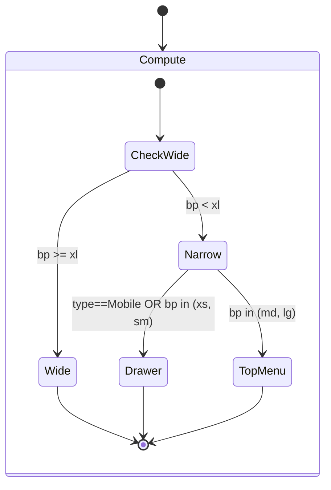

# Layout 架构与自适应引擎规范（Layout Architecture & Adaptation）

> **CRITICAL**
>
> 这是一份给 AI 与开发者共同遵守的布局架构规范。修改任何 `src/layouts/**`、`src/stores/modules/layout.ts`、`src/stores/modules/device.ts`、路由 Layout 切换逻辑之前，**必须先阅读并遵循**本文件。

---

## Chapter 1 — 总览与职责分层（Overview & Responsibilities）

本项目的布局系统分为三层，每层只负责自己那一段“结构与行为”，并通过明确的契约衔接：

### 1.1 三层结构（壳层 → Admin 壳内模式 → 模块组件）

- **壳层（LayoutMode）**：由路由 `route.meta.parent` 决定使用哪个壳
  - 入口：`src/layouts/index.vue`
  - 值域：`LayoutMode = 'admin' | 'fullscreen' | 'ratio'`（见 `src/types/systems/layout.d.ts`）
- **Admin 壳内结构模式（AdminLayoutMode）**：仅当 `LayoutMode === 'admin'` 时生效
  - 实现：`src/layouts/modules/LayoutAdmin.tsx`
  - 值域：`AdminLayoutMode = 'vertical' | 'horizontal' | 'mix'`
  - **双轨状态机**：`preferredMode`（用户偏好）与 `effectiveMode`（运行时派生）分离（详见 Chapter 2）
- **布局模块组件（Admin 模块）**：Header / Sidebar / Menu / Breadcrumb / Tabs / Footer
  - `src/layouts/components/admin/AdminHeader.vue`
  - `src/layouts/components/admin/AdminSidebar.tsx`
  - `src/layouts/components/admin/AdminSidebarMenu.tsx`
  - `src/layouts/components/admin/AdminBreadcrumbBar.vue`
  - `src/layouts/components/admin/AdminTabsBar.tsx`
  - `src/layouts/components/admin/AdminFooterBar.tsx`

### 1.2 文件映射表（File → Single Responsibility）

- **`src/layouts/index.vue`**：根据路由 `meta.parent` 在 `Admin / FullScreen / Ratio` 之间切换壳，并处理跨壳动画方向（`previousLayout` 捕获 from-layout）。
- **`src/layouts/modules/LayoutAdmin.tsx`**：Admin 壳的主编排（runAdaptive、自适应协调、Drawer 逻辑、模块渲染开关、全局右键菜单入口）。
- **`src/stores/modules/layout.ts`**：布局的 SSOT（偏好、派生模式、模块显隐、折叠/抽屉运行时状态、并发 Loading 计数器、持久化/迁移）。
- **`src/layouts/components/GlobalSetting/SettingsContent.vue`**：全局设置面板（只写 `preferredMode` 与 `visibilitySettings[preferredMode]`，避免 viewport resize 时“跳变”）。
- **`src/layouts/components/AppContainer.vue`**：内容区容器（滚动模型 + 内容区 Loading 遮罩）。
- **`src/layouts/components/AnimateRouterView.vue`**：路由过渡 + keep-alive 的统一网关（受 `layoutStore.enableTransition/enableKeepAlive` 控制）。
- **`src/layouts/modules/LayoutRatio.vue`**：比例壳（aspect ratio 响应式计算 + ResizeObserver + 内容区 Loading）。
- **`src/layouts/modules/LayoutFullScreen.vue`**：全屏壳（当前仅代理 `AppContainer`）。
- **`src/layouts/components/ContextMenuProvider.vue`**：自定义右键菜单 Provider（可 global/local，自动 clamp，路由变化自动关闭）。

### 1.3 AI 任务触发词（When AI should jump here）

当任务涉及以下关键词时，必须先读完 Chapter 1：

- “layout 模式 / 布局壳 / meta.parent / AdminLayoutMode / LayoutMode”
- “header/sidebar/breadcrumb/tabs/footer 显隐”
- “LayoutAdmin / runAdaptive / Drawer / mobile drawer”

---

## Chapter 2 — 双轨状态机（Dual-Track State Machine, SSOT）

布局系统严格区分“用户偏好”与“运行时约束解析”，**禁止用一个 `mode` 变量同时承担两者**。

### 2.1 两条轨道的定义（preferred vs effective）

- **`preferredMode`（用户偏好）**
  - 存储：`layoutStore.preferredMode`（持久化）
  - 修改入口：仅允许 Settings 面板/用户交互调用 `layoutStore.setPreferredMode(mode)`
  - 含义：用户希望的 Admin 布局模式（vertical/horizontal/mix）
- **`effectiveMode`（派生模式）**
  - 存储：`layoutStore.effectiveMode`（getter，只读）
  - 含义：在 `preferredMode` 基础上叠加设备/断点/方向约束后得到的“实际渲染模式”

> **CRITICAL：禁区声明（Anti-patterns）**
>
> - **禁止**在自适应函数（`runAdaptive` / `adaptToMobile` / `adaptToTablet` / `adaptPcByOrientation` / `adaptPcByBreakpoint`）中修改 `preferredMode` 或尝试“写死”布局模式。
> - **禁止**绕过 `effectiveMode`，在组件里通过“设备 if-else”手工拼出另一套 mode 推导逻辑（容易与 store 分叉）。
> - **禁止**在 store 中依赖路由（例如 import `vue-router` / `router.push`），导航必须由调用方负责（遵循解耦规则）。

### 2.2 响应式三区与 effectiveMode（Device-First + xl Pivot）

**三区规则**：Drawer Zone（&lt; 768px = xs/sm 或 Mobile）→ Drawer；Top Menu Fallback（768–1279px = md/lg）→ 顶栏；Wide Zone（≥ 1280px = xl+）→ Tablet 侧栏 / PC preferredMode。Logo：Drawer 区与 Tablet 始终显示；PC 仅在 md/lg 隐藏。



- **LayoutAdmin 层**：当 effectiveMode 为 horizontal 且 **（Mobile 或 bp 为 xs/sm）** 时，`isDrawerMode=true`，渲染 **Drawer**；否则在 md/lg 渲染 **Top Menu**。
- **Logo 文字**：Drawer 区（xs/sm/Mobile）与 Tablet 始终显示；PC 在 md/lg 隐藏；其余显示。

### 2.3 真实代码：`effectiveMode` getter（SSOT）

代码位置：`src/stores/modules/layout.ts`。逻辑以**设备类型 + 断点**为准：Mobile 一律 horizontal；Tablet/PC 的窄屏为 xs/sm/md/lg（&lt; xl），宽屏为 xl+ 时尊重 preferredMode。具体实现见仓库内 `effectiveMode` getter（isNarrowPc / isNarrowTablet 含 lg，pivot 为 xl）。

补充说明：

- **“移动端强制 horizontal”**：统一抽屉导航（Drawer）体验与更小的头部容器组织方式。
- **“lg 为窄屏”**：在 enterprise SaaS 下，lg (1024px) 不足以舒适支撑侧栏+复杂表格，故业务阈值提升至 xl (1280px)；Tablet/PC 在 &lt; xl 时均为 Horizontal 顶栏回退。

### 2.4 `mode` 的对外语义

为了对外屏蔽“偏好/派生”的复杂性，store 暴露：

- `layoutStore.mode`：等价于 `effectiveMode`（用于渲染）
- `layoutStore.preferredMode`：用户偏好（用于 Settings 面板配置）

### 2.5 AI 任务触发词（When AI should jump here）

- “preferredMode / effectiveMode / 派生模式 / 双轨状态机 / 断点强制”
- “移动端强制 horizontal / xl 宽屏起点 / lg 窄屏回退”

---

## Chapter 3 — 可见性系统（Visibility Settings, Contracts & SSOT）

布局模块（Header/Menu/Sidebar/Breadcrumb/Tabs/Footer/Logo）的显隐配置是独立于 mode 的第二条关键轴。

### 3.1 数据结构与 SSOT

- SSOT：`layoutStore.visibilitySettings: Record<AdminLayoutMode, LayoutVisibilitySetting>`
- 当前渲染读取：`layoutStore.activeVisibility = visibilitySettings[effectiveMode]`
- 对外兼容 getter：`showHeader/showSidebar/...` 统一读取 `activeVisibility`

代码位置：`src/stores/modules/layout.ts`

```106:134:/Users/cc/MyPorject/ccd/src/stores/modules/layout.ts
// --- active visibility (SSOT) ---
activeVisibility(state): LayoutVisibilitySetting {
  return state.visibilitySettings[this.effectiveMode]
},
// --- 兼容字段：对外仍以 showXxx 形式暴露，但实际读取 activeVisibility ---
showHeader(): boolean {
  return this.activeVisibility.showHeader
},
showMenu(): boolean {
  return this.activeVisibility.showMenu
},
showSidebar(): boolean {
  return this.activeVisibility.showSidebar
},
showBreadcrumb(): boolean {
  return this.activeVisibility.showBreadcrumb
},
showBreadcrumbIcon(): boolean {
  return this.activeVisibility.showBreadcrumbIcon
},
showTabs(): boolean {
  return this.activeVisibility.showTabs
},
showFooter(): boolean {
  return this.activeVisibility.showFooter
},
showLogo(): boolean {
  return this.activeVisibility.showLogo
},
```

### 3.2 Settings 面板的“防跳变”规则（Preferred-only）

Settings 面板必须绑定到 `preferredMode` 对应的显隐配置，避免窗口缩放导致 effectiveMode 变化而 UI 跳变：

- 读取：`layoutStore.visibilitySettings[layoutStore.preferredMode][key]`
- 写入：`layoutStore.setModuleVisible(key, v, mode?)`

代码位置：`src/layouts/components/GlobalSetting/SettingsContent.vue`

```263:299:/Users/cc/MyPorject/ccd/src/layouts/components/GlobalSetting/SettingsContent.vue
<!-- 布局模式（始终展示：控制用户偏好 preferredMode） -->
<SelectButton
  :model-value="layoutStore.preferredMode"
  :options="layoutModeOptions"
  option-value="value"
  :option-label="opt => t(opt.labelKey)"
  :allow-empty="false"
  size="small"
  class="w-full"
  @update:model-value="onLayoutModeChange"
/>

<!-- 布局模块显示（按 preferredMode 配置，不随 effectiveMode 跳变） -->
<ToggleSwitch
  :model-value="layoutStore.visibilitySettings[layoutStore.preferredMode][item.key]"
  :disabled="isLayoutModuleSwitchDisabled(item.key)"
  @update:model-value="(v: boolean) => layoutStore.setModuleVisible(item.key, v)"
/>
```

### 3.3 模式约束（Mode Hidden Modules）

为了避免出现“用户打开了一个当前模式永远不会渲染的模块”的错配体验，store 会强制约束：

- `vertical`：`showMenu` 必须为 `false`（vertical 不渲染 Top Menu）
- `horizontal`：`showSidebar` 必须为 `false`（horizontal 不渲染 Sidebar）

代码位置：`src/stores/modules/layout.ts`（`MODE_HIDDEN_MODULES` + `enforceModeVisibilityConstraints`）

```36:51:/Users/cc/MyPorject/ccd/src/stores/modules/layout.ts
const MODE_HIDDEN_MODULES: Record<AdminLayoutMode, LayoutModuleVisibilityKey[]> = {
  vertical: ['showMenu'],
  horizontal: ['showSidebar'],
  mix: [],
}

function enforceModeVisibilityConstraints(
  mode: AdminLayoutMode,
  visibility: LayoutVisibilitySetting
): LayoutVisibilitySetting {
  const next: LayoutVisibilitySetting = { ...visibility }
  MODE_HIDDEN_MODULES[mode].forEach(key => {
    next[key] = false
  })
  return next
}
```

### 3.4 父子联动（Module Dependencies）

父模块关闭时会强制关闭子模块，并在开启时按缓存恢复，防止用户体验断裂：

- Header → Logo/Menu
- Breadcrumb → BreadcrumbIcon

代码位置：`src/stores/modules/layout.ts`（`MODULE_DEPENDENCIES` + `moduleRestoreCache`）

### 3.5 AI 任务触发词（When AI should jump here）

- “显示/隐藏 header/sidebar/menu/breadcrumb/tabs/footer/logo”
- “设置面板模块开关 / visible jump / 迁移 showXxx”

---

## Chapter 4 — 响应式适配引擎（`runAdaptive()` & adapt\*）

Admin 壳的自适应逻辑位于 `src/layouts/modules/LayoutAdmin.tsx`，它的职责是：

- **只协调**：`sidebarCollapse`、`mobileDrawerOpen`、以及（必要时）触发一些布局相关事件
- **不允许**：修改 `preferredMode`（mode 的解析由 `effectiveMode` getter 统一承担）

### 4.1 真实代码：`runAdaptive()`（协调者）

代码位置：`src/layouts/modules/LayoutAdmin.tsx`

```80:114:/Users/cc/MyPorject/ccd/src/layouts/modules/LayoutAdmin.tsx
function runAdaptive() {
  const force = !layoutStore.userAdjusted
  // runAdaptive 不再修改布局模式，mode 由 layoutStore.effectiveMode 响应式派生
  if (deviceStore.type === 'PC') {
    layoutStore.adaptPcByOrientation(deviceStore.orientation)
    if (layoutStore.showSidebar) {
      layoutStore.adaptPcByBreakpoint(deviceStore.currentBreakpoint, force)
    }
    return
  }

  if (deviceStore.type === 'Tablet') {
    if (deviceStore.isMobileLayout) {
      layoutStore.adaptToTablet(true, true)
    } else {
      layoutStore.adaptToTablet(false, true)
      if (layoutStore.showSidebar) {
        layoutStore.adaptPcByBreakpoint(deviceStore.currentBreakpoint, force)
      }
    }
    return
  }

  if (deviceStore.isMobileLayout) {
    layoutStore.adaptToMobile(true, true)
    return
  }

  // Mobile 大视口：恢复侧栏模式，再按断点收展
  layoutStore.adaptToMobile(false, true)
  if (layoutStore.showSidebar) {
    layoutStore.adaptPcByBreakpoint(deviceStore.currentBreakpoint, force)
  }
}
```

### 4.2 `userAdjusted`：尊重用户意图（Auto adapt must not override user action）

- 用户手动折叠/展开侧栏：`layoutStore.toggleCollapse()` 会把 `userAdjusted = true`
- 自动适配函数的通用规则：
  - `if (userAdjusted && !force) return`
- `force` 的来源：`runAdaptive()` 中 `const force = !layoutStore.userAdjusted`
  - 在“初始化/设备切换”时允许覆盖
  - 在“用户已明确调整”后避免反复自动收展造成“抢控制权”的体验

### 4.3 Drawer 模式（Drawer Zone）激活条件

- **isDrawerMode**（`LayoutAdmin.tsx`）：**Mobile 设备** 或 **currentBreakpoint 为 xs/sm**，且 `mode === 'horizontal'` 时激活。
- 因此 &lt; 768px（xs、sm）或 UA 为 Mobile 时使用 Drawer；**md/lg 使用 Top Menu**，避免 sm 宽度（如 694px）下顶栏溢出。
- Drawer 的打开状态：`layoutStore.mobileDrawerOpen`（运行时，不持久化）。

### 4.4 禁区声明（必须遵守）

> **CRITICAL：禁区声明（Anti-patterns）**
>
> - **禁止**在 `runAdaptive()` 或 `adapt*()` 中调用 `setPreferredMode` / `updateSetting('preferredMode', ...)`。
> - **禁止**把 Tablet 当作 Mobile：Tablet 在 **xs/sm** 为 Drawer，在 **md/lg** 为 Top Menu 顶栏回退，≥ xl 为 Sidebar；禁止在 xs/sm 对 Tablet 仅用顶栏而不用 Drawer。
> - **禁止**忽略 `userAdjusted`：用户一旦手动折叠，自动逻辑不能来回“抢”折叠状态（除非 `force=true`）。
> - **禁止**将 lg (1024px) 视为宽屏：业务宽屏起点为 xl (1280px)，见 `docs/ai-specs/ADAPTIVE_LAYOUT.md` §0.1。

### 4.5 AI 任务触发词（When AI should jump here）

- “自适应 / runAdaptive / adaptToMobile / adaptToTablet / adaptPcByBreakpoint / userAdjusted”
- “移动端抽屉 / Drawer 打开关闭 / 侧栏自动折叠”

---

## Chapter 5 — UI 渲染与组件契约（UI & Component Contracts）

本章描述壳层与模块组件如何对接 store，并给出关键代码片段（真实实现）。

### 5.1 壳层切换：`layouts/index.vue`

- `currentLayoutMode`：由 `route.meta.parent` 推导
- `previousLayout`：通过 `onBeforeRouteUpdate` 捕获 from-layout，决定跨壳过渡方向
- Loading 遮罩：由 `layoutStore.isLoading` 统一驱动（见 Chapter 6）

代码位置：`src/layouts/index.vue`

```23:31:/Users/cc/MyPorject/ccd/src/layouts/index.vue
const route = useRoute()
const currentLayoutMode = computed<LayoutMode>(() => (route.meta?.parent as LayoutMode) || 'admin')
const previousLayout = ref<LayoutMode>(currentLayoutMode.value)

onBeforeRouteUpdate((_to, from) => {
  previousLayout.value = (from.meta?.parent as LayoutMode) || 'admin'
})
```

### 5.2 Admin 壳：`LayoutAdmin.tsx` 的渲染分支

核心分支：

- `horizontal`：Header + Content（无 Sidebar）
- `vertical/mix`：Sidebar + Content
- 移动端 Drawer：当 `isDrawerMode` 时，Sidebar 不渲染，改用 PrimeVue `<Drawer>`

### 5.3 可见性读取契约（Visibility SSOT）

> **规则**：布局 wrapper（壳/模块）渲染开关必须读取 `layoutStore.visibilitySettings[layoutStore.effectiveMode]`（store 已封装为 `showHeader/showSidebar/...`）。

在 `LayoutAdmin.tsx` 中，模块显隐读取示例：

```153:172:/Users/cc/MyPorject/ccd/src/layouts/modules/LayoutAdmin.tsx
const showHeader = computed(() => layoutStore.showHeader)
const showLogo = computed(() => layoutStore.showLogo)
const showMenu = computed(() => layoutStore.showMenu)
```

### 5.4 语义化交互（Semantic Buttons & A11y）

**规则**：对于 Header/Sidebar 等紧凑区域的图标按钮，优先使用原生 `<button type="button">`，并使用 `interactive-focus-ring` 做键盘可达性提示。

真实代码示例（移动端汉堡按钮）：

```223:233:/Users/cc/MyPorject/ccd/src/layouts/components/admin/AdminHeader.vue
<button
  v-if="isMobileLayout"
  type="button"
  class="bg-transparent border-none p-0 outline-none interactive-focus-ring"
  @click="layoutStore.toggleMobileDrawer()"
>
  <Icons
    name="i-lucide-menu"
    size="2xl"
  />
</button>
```

真实代码示例（用户头像入口按钮）：

```49:58:/Users/cc/MyPorject/ccd/src/layouts/components/User/index.vue
<button
  type="button"
  class="layout-full! rounded-full bg-transparent border-none p-0 outline-none interactive-focus-ring cursor-pointer"
  @click="togglePanel"
>
  
</button>
```

> **CRITICAL：禁区声明（Anti-patterns）**
>
> - **禁止**用 `<div @click>`、`` 充当交互入口（不符合语义与键盘可达性要求）。
> - **禁止**在紧凑图标区域强行使用 PrimeVue `<Button>` 导致 padding/尺寸破坏布局；此类场景以原生 `<button>` + 语义类为优先。

### 5.5 Sidebar Menu 的“双形态”契约（Expanded vs Collapsed）

`AdminSidebarMenu.tsx` 的两种形态：

- **展开态（sidebarCollapse=false）**：PrimeVue `PanelMenu`，展开 keys 持久化到 store
- **折叠态（sidebarCollapse=true）**：图标按钮列表 + `TieredMenu` popup 子菜单

关键点：

- **Accordion（互斥展开）**：由 `layoutStore.sidebarUniqueOpened` 决定，根级互斥通过 `applyUniqueRoot()` 实现
- **自动展开父路径**：根据 `route.meta.parentPaths` 更新 `expandedMenuKeys`
- **截断检测 + Tooltip**：通过 `useAppElementSize` 监听容器宽度并测量 `scrollWidth > clientWidth`

### 5.6 Breadcrumb & Tabs 的契约（与路由联动）

Breadcrumb：

- 数据来自 `useAdminBreadcrumbs()`（hooks 层）
- 每个面包屑节点可独立挂载 `TieredMenu` popup（存在子项时）

Tabs：

- 数据来自 `useAdminTabs()`
- 激活条位置由 `activeTabStyle` 计算与更新
- 右键菜单为自绘 overlay，避免引入额外 UI 依赖

### 5.7 Ratio 壳的“响应式边界”

`LayoutRatio` 的关键点不是“画一个按比例缩放的容器”，而是 **确保该比例对路由 meta 的变化是响应式的**，并且对容器尺寸变化不依赖不可靠的全局窗口快照。

真实实现（响应式 aspectRatio + ResizeObserver + rAF 调度）：

```14:38:/Users/cc/MyPorject/ccd/src/layouts/modules/LayoutRatio.vue
const route = useRoute()

function parseRatioString(input?: unknown): number {
  const fallback = 16 / 9
  if (!input) {
    return fallback
  }
  const str = String(input).trim()
  const match = str.match(/^(\d+(?:\.\d+)?)\s*:\s*(\d+(?:\.\d+)?)$/)
  if (match) {
    const w = parseFloat(match[1])
    const h = parseFloat(match[2])
    if (w > 0 && h > 0) {
      return w / h
    }
  }
  const n = Number(str)
  if (!Number.isNaN(n) && n > 0) {
    return n
  }
  return fallback
}

const aspectRatio = computed<number>(() => parseRatioString(route.meta?.ratio))
```

> **CRITICAL：禁区声明（Anti-patterns）**
>
> - **禁止**用非响应式快照（例如在 setup 时一次性读取 `route.meta` 然后不再更新）驱动 ratio。
> - **禁止**只监听 `window.innerWidth/innerHeight` 而忽略容器变化；这里必须以容器为边界（ResizeObserver）。

### 5.8 AppContainer 的滚动模型与内容区 Loading

`AppContainer.vue` 是内容区滚动的 SSOT：用 `CScrollbar` 承载路由视图，并在路由切换时滚动到顶部；内容区 Loading 遮罩由 `layoutStore.isPageLoading` 控制。

```22:39:/Users/cc/MyPorject/ccd/src/layouts/components/AppContainer.vue
<div class="layout-full relative">
  <CScrollbar
    ref="scrollbarRef"
    class="layout-full rounded-scale-md shadow-soft"
  >
    <AnimateRouterView class="flex-1" />
  </CScrollbar>

  <!-- 内容区 Loading 遮罩：路由切换时显示 -->
  <Transition name="fade">
    <div
      v-show="isPageLoading"
      class="absolute inset-0 z-10 flex items-center justify-center backdrop-blur-sm pointer-events-auto"
    >
      <Loading size="xl" />
    </div>
  </Transition>
</div>
```

### 5.10 样式规范交叉引用（Styling Cross-Reference）

布局组件的样式必须遵循 Anti-Utility-Soup 原则（详见 `CLAUDE.md` §4.3-B Rule N-5）。新增或修改布局组件时，当结构类超过 5 个原子类应优先使用语义快捷类（如 `col-fill`、`panel-base`、`row-y-center`、`col-stack-*`）。本文档中已有代码引用反映当前实现快照，不代表最佳实践模板。

### 5.11 AI 任务触发词（When AI should jump here）

- “AdminHeader / AdminSidebar / Drawer / 汉堡菜单 / 用户入口”
- “SidebarMenu 展开/折叠 / accordion / expandedKeys / parentPaths”
- “ratio meta / aspect ratio / ResizeObserver”
- “AppContainer 滚动 / page loading 遮罩”

---

## Chapter 6 — Loading 系统（Concurrent-safe Loading Counters）

布局系统的 Loading 不是简单的 boolean，而是 **并发安全计数器**。这样才能保证“多个并行请求/初始化步骤”不会互相覆盖 Loading 状态。

### 6.1 状态字段（SSOT）

位于 `src/stores/modules/layout.ts`：

- **全局 Loading**
  - `loadingCount: number`（SSOT）
  - `isLoading: boolean`（由 count 推导并同步）
- **内容区 Loading**
  - `pageLoadingCount: number`（SSOT）
  - `isPageLoading: boolean`（由 count 推导并同步）

```65:76:/Users/cc/MyPorject/ccd/src/stores/modules/layout.ts
// ===== 运行时 Loading（并发安全：使用计数器作为 SSOT）=====
// 启动阶段默认处于全局 loading（由 setupPlugins finally 结束）
loadingCount: 1,
pageLoadingCount: 0,
/** 全局加载遮罩（由 loadingCount 推导并同步） */
isLoading: true,
/** 内容区加载遮罩（由 pageLoadingCount 推导并同步） */
isPageLoading: false,
```

### 6.2 对外 API（begin/end）

必须使用 begin/end 维护计数器，避免“谁先结束就把 Loading 关掉”的竞态：

```331:350:/Users/cc/MyPorject/ccd/src/stores/modules/layout.ts
/** 并发安全：开始全局 loading（计数 +1） */
beginGlobalLoading() {
  this.loadingCount += 1
  this.isLoading = this.loadingCount > 0
},
/** 并发安全：结束全局 loading（计数 -1，带下限保护） */
endGlobalLoading() {
  this.loadingCount = Math.max(0, this.loadingCount - 1)
  this.isLoading = this.loadingCount > 0
},
/** 并发安全：开始内容区 loading（计数 +1） */
beginPageLoading() {
  this.pageLoadingCount += 1
  this.isPageLoading = this.pageLoadingCount > 0
},
/** 并发安全：结束内容区 loading（计数 -1，带下限保护） */
endPageLoading() {
  this.pageLoadingCount = Math.max(0, this.pageLoadingCount - 1)
  this.isPageLoading = this.pageLoadingCount > 0
},
```

### 6.3 UI 挂载点（Global vs Page）

- **全局 Loading 遮罩**：挂载在 `src/layouts/index.vue`
  - 由 `layoutStore.isLoading` 控制
  - 使用 `AnimateWrapper` 做淡入淡出
- **内容区 Loading 遮罩**：挂载在 `AppContainer.vue` 与 `LayoutRatio.vue`
  - 由 `layoutStore.isPageLoading` 控制

### 6.4 禁区声明（必须遵守）

> **CRITICAL：禁区声明（Anti-patterns）**
>
> - **禁止**在业务代码里直接 `layoutStore.isLoading = false` / `true`（会破坏计数器 SSOT）。
> - **禁止**用一个临时 boolean 变量替代 store 计数器，在多个并发入口下会造成遮罩闪烁或提前消失。
> - **禁止**新增“自定义全局 Loading 组件”绕过 `layouts/index.vue` 的统一入口。

### 6.5 AI 任务触发词（When AI should jump here）

- “loading 闪烁 / 多请求并发 / 初始化 loading / page loading”
- “全局遮罩 / 内容区遮罩”

---

## Chapter 7 — 持久化与迁移（Persistence & Migration）

布局系统包含“持久化配置”与“运行时状态”，必须清晰区分，以免出现刷新后状态异常或升级后丢配置。

### 7.1 持久化字段清单（Explicit Pick）

持久化字段由 `src/constants/layout.ts` 中 `LAYOUT_PERSIST_PICK` 显式列出（避免迁移期 keys 推导导致字段漂移）：

```58:70:/Users/cc/MyPorject/ccd/src/constants/layout.ts
export const LAYOUT_PERSIST_PICK: (keyof LayoutStoreState)[] = [
  'preferredMode',
  'sidebarCollapse',
  'sidebarUniqueOpened',
  'sidebarFixed',
  'headerFixed',
  'enableTransition',
  'transitionName',
  'enableKeepAlive',
  'visibilitySettings',
  'expandedMenuKeys',
  'userAdjusted',
] as (keyof LayoutStoreState)[]
```

### 7.2 加密序列化（Encrypted Serializer）

layout store 使用加密序列化器持久化到 localStorage：

```454:459:/Users/cc/MyPorject/ccd/src/stores/modules/layout.ts
persist: {
  key: `${import.meta.env.VITE_PINIA_PERSIST_KEY_PREFIX}-layout`,
  storage: localStorage,
  serializer: createPiniaEncryptedSerializer(),
  pick: LAYOUT_PERSIST_PICK,
},
```

### 7.3 旧版迁移：showXxx 平铺 → visibilitySettings 分模式

项目已经实现 `migrateLegacyVisibilityIfNeeded()`，用来把旧结构（root 上平铺 `showHeader/showSidebar/...`）迁移到新结构（`visibilitySettings[mode].showXxx`）。

触发点：`LayoutAdmin.tsx` 的 `onMounted()` 中调用：

```116:119:/Users/cc/MyPorject/ccd/src/layouts/modules/LayoutAdmin.tsx
onMounted(() => {
  layoutStore.migrateLegacyVisibilityIfNeeded()
  runAdaptive()
})
```

迁移策略要点：

- 检测到 legacy showXxx 字段时，将其快照复制到三种 mode 的 `visibilitySettings`
- 同步执行 `enforceModeVisibilityConstraints`，确保 vertical/horizontal 的隐藏模块约束被应用
- 删除 legacy 字段，防止后续误用

### 7.4 运行时状态 vs 持久化配置（Boundary）

请牢记哪些状态**不应持久化**（刷新后应回到安全默认）：

- `mobileDrawerOpen`：运行时 UI 状态（刷新后应关闭）
- `loadingCount/pageLoadingCount/isLoading/isPageLoading`：运行时并发计数器（刷新后按启动流程初始化）
- `moduleRestoreCache`：运行时恢复缓存（不应持久化）

### 7.5 禁区声明（必须遵守）

> **CRITICAL：禁区声明（Anti-patterns）**
>
> - **禁止**把 `mobileDrawerOpen`、`moduleRestoreCache` 等运行时状态加入持久化 pick（会导致刷新后 UI 处于不一致状态）。
> - **禁止**把 store 的字段 pick 改回“动态 Object.keys 推导”，迁移期会非常脆弱且难以回滚。
> - **禁止**删除迁移逻辑但不提供版本化迁移策略；布局配置属于用户偏好，丢失会破坏体验。

### 7.6 AI 任务触发词（When AI should jump here）

- “布局配置刷新丢失 / 持久化 / pinia persist / 加密 / migrate legacy”
- “showXxx 迁移 / visibilitySettings 结构调整”

---

## 附录 A — 关键类型（SSOT Types）

类型位置：`src/types/systems/layout.d.ts`

- `LayoutMode`：壳层选择（admin/fullscreen/ratio）
- `AdminLayoutMode`：Admin 壳内模式（vertical/horizontal/mix）
- `LayoutVisibilitySetting`：模块显隐集合
- `LayoutStoreState`：完整 store state（含持久化与运行时字段）

```7:23:/Users/cc/MyPorject/ccd/src/types/systems/layout.d.ts
export type LayoutMode = 'admin' | 'fullscreen' | 'ratio'
export type AdminLayoutMode = 'vertical' | 'horizontal' | 'mix'

export interface LayoutVisibilitySetting {
  showHeader: boolean
  showMenu: boolean
  showSidebar: boolean
  showBreadcrumb: boolean
  showBreadcrumbIcon: boolean
  showTabs: boolean
  showFooter: boolean
  showLogo: boolean
}
```

---

## 附录 B — Layout 相关文件清单（Quick Jump）

- 壳层入口：`src/layouts/index.vue`
- Admin 壳：`src/layouts/modules/LayoutAdmin.tsx`
- Ratio 壳：`src/layouts/modules/LayoutRatio.vue`
- Fullscreen 壳：`src/layouts/modules/LayoutFullScreen.vue`
- 内容容器：`src/layouts/components/AppContainer.vue`
- 路由过渡：`src/layouts/components/AnimateRouterView.vue`
- 设置面板：`src/layouts/components/GlobalSetting/SettingsContent.vue`
- 右键菜单：`src/layouts/components/ContextMenuProvider.vue`
- Header：`src/layouts/components/admin/AdminHeader.vue`
- Sidebar：`src/layouts/components/admin/AdminSidebar.tsx`
- SidebarMenu：`src/layouts/components/admin/AdminSidebarMenu.tsx`
- Breadcrumb：`src/layouts/components/admin/AdminBreadcrumbBar.vue`
- Tabs：`src/layouts/components/admin/AdminTabsBar.tsx`
- Footer：`src/layouts/components/admin/AdminFooterBar.tsx`
- Store：`src/stores/modules/layout.ts`
- 常量：`src/constants/layout.ts`
