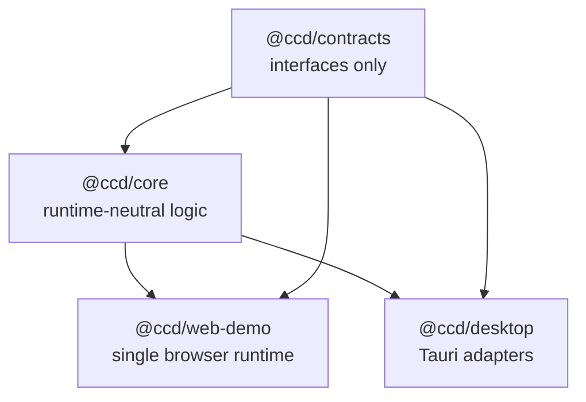

# CCD Platform Architecture

CCD is a governed deterministic multi-runtime platform monorepo. Its primary architecture goal is to keep platform contracts, runtime-neutral logic, and runtime adapters separated by enforceable dependency boundaries.

## Package Topology

```text
packages/contracts
        ↓
packages/core
        ↓
apps/web-demo
apps/desktop
```

| Workspace            | Role                                                           | Allowed Dependencies                          | Runtime Access         |
| -------------------- | -------------------------------------------------------------- | --------------------------------------------- | ---------------------- |
| `packages/contracts` | Public ABI: interfaces and shared types                        | none                                          | forbidden              |
| `packages/core`      | Runtime-neutral platform logic                                 | `@ccd/contracts`                              | forbidden              |
| `apps/web-demo`      | Browser runtime shell and sole browser runtime source of truth | `@ccd/contracts`, `@ccd/core`                 | adapters only          |
| `apps/desktop`       | Tauri runtime shell                                            | `@ccd/contracts`, `@ccd/core`, Tauri packages | `src/adapters/**` only |
| `root`               | Orchestration-only shell                                       | none                                          | no runtime code        |

## Dependency Direction



Hard rules:

- `packages/contracts` contains types/interfaces only.
- `packages/core` never imports apps, browser APIs, Node APIs, Tauri APIs, timers, console, crypto, fetch, or storage globals.
- Apps never import sibling apps.
- All package imports use public package exports only.
- Root contains orchestration/configuration only and must not host runtime source code.
- Removed runtime archive directories must not be recreated or imported.

## Runtime Adapter Architecture

Runtime capabilities are injected into core through contracts:

- `Logger`
- `NetworkClient`
- `StorageAdapter`
- `Scheduler`
- `CryptoProvider`
- `EnvironmentProvider`
- optional desktop `FileSystemAdapter`

Adapter ownership:

```text
apps/web-demo/src/adapters/**   -> browser storage, browser network, browser logger
apps/desktop/src/adapters/**    -> Tauri invoke, filesystem, desktop runtime translation
```

Adapters are translation layers only. They must not accumulate business rules, workflow orchestration, or shared state.

## Governance Architecture

```text
.ai/protocol/**      -> agent entrypoints and adapter manifests
.ai/rules/**         -> architecture and implementation laws
.ai/skills/**        -> local AI execution skills
.ai/manifests/**     -> generated routing/rule/skill locks
scripts/architecture -> executable architecture validation
scripts/governance   -> unified gate, generated reports, and diagrams
.github/workflows    -> CI enforcement
```

Generated compatibility entrypoints:

- `AGENTS.md` from `.ai/protocol/AI.entry.md`
- `CLAUDE.md` from `.ai/protocol/adapter-manifest.json`
- local Codex skills from `.ai/skills/**`

## Build Graph

Turbo orchestrates package tasks with topological dependencies:

```text
contracts build -> core build -> app builds
```

Task families:

- `build`
- `type-check`
- `test`
- affected-only variants for lint/test/typecheck/build

## Architecture Observability

Generated outputs:

- `docs/generated/governance-report.md`
- `docs/generated/api-surface-report.md`
- `docs/generated/sbom.json`
- `docs/generated/diagrams/*.mmd`
- `.ai/generated/governance-report.json`

These reports expose dependency graph summary, runtime leak scan state, API surface, supply-chain baseline, and build topology.

## Architecture Decision Records

- [ADR-001: Monorepo Runtime Boundary](./adr/ADR-001-monorepo-runtime-boundary.md)
- [ADR-002: Removed Browser Runtime Archive](./adr/ADR-002-legacy-freeze-policy.md)
- [ADR-003: Governance Pipeline](./adr/ADR-003-governance-pipeline.md)
- [ADR-004: Runtime Environment Policy](./adr/ADR-004-runtime-environment-policy.md)

## Ownership and Replacement Readiness

- [Ownership and Boundary Authority](./architecture/ownership-boundaries.md)
- [Removed Browser Runtime Archive Checklist](./architecture/legacy-equivalence-checklist.md)

## Removed Archive Cleanup

Browser duplicate archive cleanup guidance lives in:

- `docs/architecture/legacy-web-demo-cleanup.md`

## Self-Protection Layer

The architecture is protected by the unified governance gate:

```bash
pnpm governance:gate
```

The gate reads `.ai/governance/policies/**`, validates runtime and dependency boundaries, checks API snapshots, enforces supply-chain policy, validates release topology, and regenerates governance reports. GitHub CI runs this gate before typecheck, tests, lint, and production builds.

## Validation

```bash
pnpm install --frozen-lockfile
pnpm governance:gate
pnpm lint
pnpm typecheck
pnpm test
pnpm build
```
