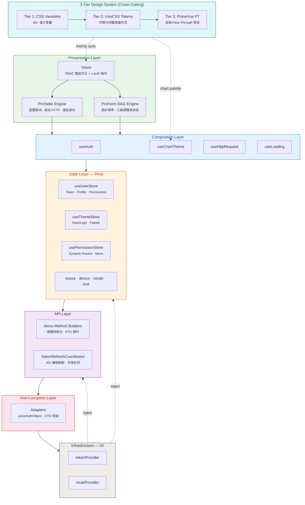
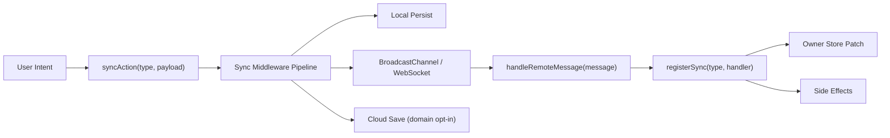

# CCD 架构与特性

面向希望理解分层、数据流与工程能力的读者。若你只想跑起来项目，请先看仓库根目录的 [README](../README.md)。

---

## 架构拓扑



**数据流**：`HTTP → Adapters → API Builders → Hooks → Stores → Views`，禁止反向依赖。`Infra` 通过依赖注入消解 HTTP、Pinia、Router 之间的环。

---

## 核心特性矩阵

### ProForm DAG 引擎

用有向无环图编排字段依赖，避免手写联动链。

- **Kahn 拓扑排序**：解析阶段检测环，运行时按安全顺序更新
- **三级流水线**：`DisableEngine → RequiredEngine → VisibilityEngine`，`disabledIf` / `requiredIf` / `visibleIf` 响应式求值
- **级联场景**：多字段依赖（如省市区邮编）可声明式表达
- **插件与持久化**：Schema 驱动，可扩展

### ProTable 低代码引擎

表格以配置为主，减少重复的 `ref(data)` / `ref(loading)`。

- **配置驱动**：`api`、`columns`、`data-key` 等 Prop 组合出 CRUD 列表
- **自治 HTTP**：分页映射、错误与竞态处理内置
- **valueEnum**：枚举列声明式渲染（Tag / Badge）
- **TanStack Virtual**：虚拟滚动与无限滚动
- **URL 同步**：筛选、排序、分页可分享链接

### 三层设计系统（零硬编码色值）

语义 Token 贯穿 CSS 变量、UnoCSS 与 PrimeVue PT。

| 层级       | 载体                   | 职责                                                                     |
| ---------- | ---------------------- | ------------------------------------------------------------------------ |
| **Tier 1** | CSS Custom Properties  | 60+ 语义变量（`--primary`、`--background`、`--sidebar-*` 等）            |
| **Tier 2** | UnoCSS Semantic Tokens | 闭集快捷方式（`bg-background`、`text-foreground`、`surface-primary` 等） |
| **Tier 3** | PrimeVue Pass-Through  | 全局 PT（如 `formControlsPt`、`menuPt`），减少组件样板代码               |

- **语义材质**：`glass-panel`、`glass-shell`、`glass-card`、`glass-icon-box`、`glass-capsule`、`material-solid`、`material-elevated`、`interactive-card`、`interactive-item`
- **主题预设治理**：完整 palette source data 与维护流程见 [Theme Presets](./theme-presets.md)
- **主题切换动画**：Curtain、Diamond、Fade、Circle、Glitch、Implosion
- **明暗层次**：亮色偏外阴影，暗色偏内高光与清晰边框
- **Z-Index**：`z-base` → `z-content` → `z-layout` → `z-overlay` → `z-popover` → `z-toast`

### Layout Runtime SSOT

后台布局适配采用单一运行时控制器，渲染层不再本地推导设备、断点、抽屉、侧栏或模式。

```txt
Device Runtime
  -> Breakpoint Runtime
  -> Adaptive Size Runtime
  -> Layout Runtime Controller
  -> Pure Layout Renderers
```

| 层级                                   | 职责                                                                            |
| -------------------------------------- | ------------------------------------------------------------------------------- |
| `src/stores/modules/system/device.ts`  | 原始设备、视口、断点、方向、像素比与 resize/orientation/visualViewport 生命周期 |
| `src/utils/theme/sizeEngine.ts`        | 尺寸、字体、密度、断点缩放与 CSS 变量注入                                       |
| `src/layouts/runtime/layoutRuntime.ts` | `effectiveMode`、`sidebarMode`、drawer/overlay、结构显隐、安全区样式的最终解析  |
| `src/hooks/layout/useLayoutRuntime.ts` | 将 store 输入收敛为渲染层可消费的稳定运行时状态                                 |
| `src/layouts/modules/*`                | 纯渲染，只消费 `useLayoutRuntime()`，不读取设备 store 或断点常量                |

布局 shell 的约束以 [.ai/rules/integrations/03-layout-architecture.mdc](../.ai/rules/integrations/03-layout-architecture.mdc) 为准。涉及 iPhone/iPad/桌面适配时，需要用 Playwright 几何断言验证侧栏、内容偏移、header、安全区、drawer 和 phantom spacing。

### Explicit Sync Boundary

系统偏好同步已经从“隐式监听 store 变化”升级为“显式同步入口 + 白名单注册”。

这是 CCD 的核心架构亮点之一：同步不是 Pinia 的默认副作用，而是一种需要声明、注册、校验和审计的系统能力。它把“跨 Tab / 跨设备一致性”拆成四个可控制面：

| 控制面    | 约束                                                      |
| --------- | --------------------------------------------------------- |
| Intent    | 只有明确用户意图触发的变化才能调用 `syncAction`           |
| Type      | 同步类型必须注册，未注册类型会被阻断                      |
| Payload   | 只携带可共享字段和 `updatedAt`，不广播完整 store snapshot |
| Ownership | handler 只写 owner store，并集中执行必要副作用            |



当前同步栈：

| 层级            | 位置                                     | 职责                                         |
| --------------- | ---------------------------------------- | -------------------------------------------- |
| Entry           | `src/sync/syncAction.ts`                 | 显式同步入口，只允许已注册类型进入链路       |
| Registry        | `src/sync/registry.ts`                   | 维护同步白名单与类型处理器                   |
| Middleware      | `src/sync/middleware.ts`                 | 统一执行本地持久化、传输、云端保存等中间环节 |
| Transport       | `src/sync/runtime.ts`                    | 收敛 BroadcastChannel / WebSocket 通道       |
| Domain Handlers | `src/sync/systemPreferences/register.ts` | patch owner store 并执行副作用               |
| Domain Model    | `src/sync/systemPreferences/*`           | payload 清洗、归一化、本地持久化、版本控制   |

硬约束：

- 只有通过 `syncAction(type, payload)` 的数据才会跨 Tab / 跨设备传播
- 所有同步类型必须先在 registry 中注册
- 禁止使用 `store.$subscribe()` 做自动同步
- 禁止在业务层直接操作 `BroadcastChannel`、`WebSocket` 或手写 state sync transport frame
- 非状态同步的基础设施通道必须进入 `scripts/ai-architecture-guard.mjs` allowlist
- payload 必须只包含“可持久化且需要一致性”的字段，并携带 `updatedAt`
- handler 必须只写 owner store，并在需要时补齐副作用（如 `refreshTheme()`、`initLocale()`）

这套设计的目标不是“自动同步所有状态”，而是“只同步被显式声明为跨端一致的数据”。
换句话说，CCD 把状态同步定义为 capability，而不是 default behavior。

#### 适合同步的数据

- 用户偏好：theme、size、layout、locale
- 用户主动编辑的草稿或偏好型筛选条件
- 需要在多 Tab / 多设备保持一致的轻量业务状态

#### 不应同步的数据

- loading、skeleton、pending flags
- drawer / modal / hover / focus / animation 等运行时 UI 状态
- 设备断点、viewport、layout runtime 推导态
- 服务端实时推流、瞬时缓存、纯展示型派生态

#### 新业务 store 的接入方式

1. 定义同步类型，例如 `list:update`
2. 在 `src/sync/registry.ts` 注册 handler
3. 仅在“用户意图明确的修改点”调用 `syncAction`

示例：

```ts
registerSync('list:update', payload => {
  const listStore = useListStore()
  listStore.$patch(payload)
})

syncAction('list:update', {
  items,
  updatedAt: Date.now(),
})
```

错误示例：

```ts
listStore.$subscribe(() => {
  syncAction('list:update', listStore.$state)
})
```

上面的写法会把同步边界退化回“隐式观察 + 全量广播”，这是当前架构明确禁止的。

### 安全与隔离

- **RBAC**：模板侧 `v-auth`（含 `.disable`），脚本侧 `useAuth()`
- **防腐层**：`src/adapters` 收敛外部数据；`src/infra` 承担依赖注入
- **SafeStorage**：加密与压缩，持久化走统一通道
- **TokenRefreshCoordinator**：401 静默刷新与请求排队，业务不写重复鉴权逻辑

### 构建与性能

| 策略                 | 实现                                                                                               |
| -------------------- | -------------------------------------------------------------------------------------------------- |
| **精细拆包**         | 7 类 `manualChunks`：vue · ecosystem · echarts · gsap · lottie · primevue · utils                  |
| **ECharts 深度摇树** | `moduleSideEffects: false` 构建插件 + 按需注册，未用图表零残留                                     |
| **Lottie 极限瘦身**  | Light Build（~60KB 减包）+ JSON `Map` 缓存 + 动态 `import()`                                       |
| **微碎片自动合并**   | `experimentalMinChunkSize: 2KB`，< 2KB 的碎片 chunk 自动聚合                                       |
| **双重预压缩**       | Gzip + Brotli 同时产出，`VITE_COMPRESSION=both`                                                    |
| **首屏加速**         | `preconnect` + `dns-prefetch` 注入 · 主题 FOIT fallback · 纯 CSS Loader                            |
| **静态资源**         | WebP 位图 · 4KB base64 内联 · `treeshake.preset: 'smallest'` · SFC `hoistStatic` + `cacheHandlers` |

### ECharts 与主题

业务只写数据形态，颜色与暗色适配由 `useChartTheme` 注入。

```ts
const rawOption = computed(() => ({
  series: [{ name: 'Sales', type: 'bar', data: [120, 200, 150] }],
}))

const { option } = useChartTheme(rawOption)
```

常见图表类型（柱/线/饼/雷达/树/矩形树图/关系/K 线/旭日等）均走同一主题管线。

### 工程化

- **AI / Architecture Gates**：`ai:doctor`、`ai:guard`、`validate:tokens`、`drift-check`
- **CI**：AI adapter sync、Architecture Doctor、Drift Check、`vue-tsc`、Vitest、ESLint、生产构建
- **Git**：Husky、CommitLint、lint-staged
- **i18n**：vue-i18n（zh-CN / en-US）与 PrimeVue 本地化
- **GitHub Actions**：CI 与演示站点部署工作流

### 常用命令（参考）

```bash
pnpm type-check       # vue-tsc
pnpm lint             # ESLint
pnpm lint:fix         # ESLint 自动修复
pnpm test             # Vitest 交互
pnpm test:run         # Vitest 单次
pnpm build:analyze    # 构建 + 体积分析
pnpm commit           # Commitizen
```

---

## 目录规约

```text
src/
├── adapters/          # 防腐层：外部数据校验与 DTO 收敛
├── api/               # Alova 方法构建器（模块内两层目录）
├── assets/            # 静态资源、全局样式、主题动画
├── components/        # ProForm、ProTable、UseEcharts、PrimeDialog、Icons 等
├── constants/         # 路由、布局、主题、断点等常量
├── design-engine/     # UnoCSS：tokens、shortcuts、safelist、validators
├── directives/        # v-auth、v-tap、v-swipe、v-long-press
├── hooks/             # 组合式函数（布局、图表主题、交互等）
├── infra/             # tokenProvider、routeProvider 等 DI
├── layouts/           # Admin、Ratio、FullScreen（需显式 import）
├── locales/           # 语言包与 PrimeVue 本地化
├── plugins/           # Vue 插件装配
├── router/            # 路由模块、动态路由、守卫
├── sync/              # 显式状态同步入口、registry、middleware、transport 与 domain handlers
├── stores/            # Pinia 模块
├── types/             # dto、systems、modules 等类型分层
├── utils/             # http、date、safeStorage、theme 等
└── views/             # 业务与示例页面
```

---

## Example 模块

`src/views/example/` 提供大量演示页，与 `.ai/rules/` 中的架构约定对应，便于对照学习：

- ProForm：基础、高级、DAG、校验、分组、插件、Playground
- ProTable：列配置、服务端分页、虚拟/无限滚动、与表单联动
- 架构示例：RBAC、Adapters、Infra、Router Meta、Stores、指令
- 组件示例：图标、ECharts、动画、滚动条、Dialog、Toast

业务落地时可删除 `example/`，或通过 `UNO_DEMO` 与 `import.meta.glob` 在生产构建中剔除。

---

## AI 架构系统

CCD 现在不是“项目代码 + 零散 AI 配置”，而是把 AI 治理也视为架构的一部分。

### 分层

| 层级          | 位置                                                            | 职责                               |
| ------------- | --------------------------------------------------------------- | ---------------------------------- |
| Canonical     | `.ai/**`                                                        | 规则、技能、协议、清单、运行态模板 |
| Generated     | `AGENTS.md`、`CLAUDE.md`                                        | 兼容适配输出，不是源文件           |
| Local runtime | `~/.codex/skills/**`、`artifacts/browser/**`、`~/.codex/tmp/**` | 本机执行入口与浏览器运行态         |

### Skill 拓扑

- `.ai/skills/core/**`
  - Vue、VueUse、UnoCSS、Vite 这类实现型能力
- `.ai/skills/codex/**`
  - `task-orchestrator`
  - `architecture-browser-master`
  - `github-ops`

这个拆分让实现能力、操作能力、兼容层各自演进，不再相互污染。

### 生成层门禁

CCD 已把“AI 按架构生成代码”收敛成硬门禁，而不是纯 prompt 约定：

- `pnpm ai:scaffold:view-route`
  - 生成新的业务 `route + view + hook` 骨架
- `pnpm ai:guard`
  - 扫描业务页面、路由模块、stores 的常见架构违例
- `pnpm ai:doctor`
  - 校验 canonical 资产、适配层和门禁链是否漂移

因此新增业务页面时的推荐顺序是：

1. `pnpm ai:scaffold:view-route`
2. 让 AI 在骨架上补业务
3. `pnpm ai:guard`
4. `pnpm ai:doctor`

### 浏览器自动化

CCD 的浏览器链路已经升级为：

`Playwright CRX -> Python export -> flow-import -> flow-run -> summary.json`

原则是：

- AI 负责高层决策和结果判断
- 本地脚本负责重复浏览器动作
- 浏览器证据先读摘要，再读截图或原始日志

更完整的运行说明见 [docs/ai-workspace.md](./ai-workspace.md) 和 [docs/codex/quickstart.md](./codex/quickstart.md)。

---

## 交付系统

除了应用运行时，CCD 还把交付治理也纳入架构能力。

### Runtime Delivery Governance

- `main` 是能力源
- Desktop / Tauri 运行时资产在仓库内直接维护
- 生成层与治理层通过本地门禁和 CI 门禁统一校验

当前交付治理机制具备：

- `pnpm ai:doctor` 门禁自检
- `pnpm drift-check` 运行时与文档/样式漂移检查
- Husky 本地阻断
- GitHub Actions 防漂移校验
- `AGENTS.md`、`CLAUDE.md`、`.ai/manifests/skills-lock.json` 自动同步一致性检查
- 运行时与治理层漂移分离审计

这意味着交付链路不再依赖派生桌面分支，而是围绕同一条主线和同一套可审计门禁持续收敛。

---

## 文档系统

CCD 的文档现在也按架构层次组织，而不是只有一个 README。

| 文档                                              | 定位                                    |
| ------------------------------------------------- | --------------------------------------- |
| [README.md](../README.md)                         | 对外入口与项目导航                      |
| [docs/architecture.md](./architecture.md)         | 运行时架构与引擎设计                    |
| [docs/ai-workspace.md](./ai-workspace.md)         | AI 工作区、浏览器自动化、清理和交付同步 |
| [docs/codex/quickstart.md](./codex/quickstart.md) | Codex 日常操作与低 token 工作流         |

这样产品架构、AI 治理和交付系统都能被单独阅读，又能拼成完整系统。
