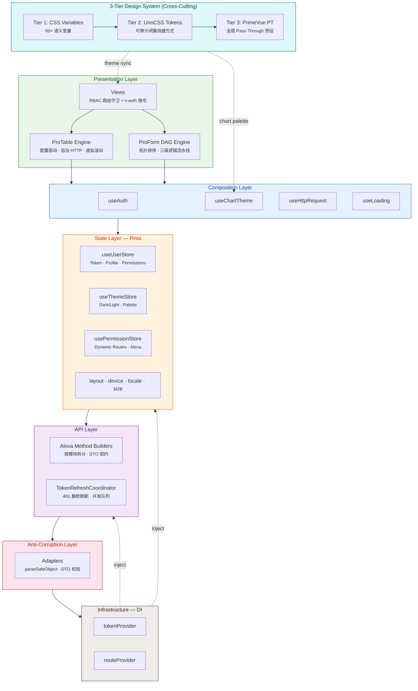

# CCD 架构与特性

面向希望理解分层、数据流与工程能力的读者。若你只想跑起来项目，请先看仓库根目录的 [README](../README.md)。

---

## 架构拓扑



**数据流**：`HTTP → Adapters → API Builders → Hooks → Stores → Views`，禁止反向依赖。`Infra` 通过依赖注入消解 HTTP、Pinia、Router 之间的环。

---

## 核心特性矩阵

### ProForm DAG 引擎

用有向无环图编排字段依赖，避免手写联动链。

- **Kahn 拓扑排序**：解析阶段检测环，运行时按安全顺序更新
- **三级流水线**：`DisableEngine → RequiredEngine → VisibilityEngine`，`disabledIf` / `requiredIf` / `visibleIf` 响应式求值
- **级联场景**：多字段依赖（如省市区邮编）可声明式表达
- **插件与持久化**：Schema 驱动，可扩展

### ProTable 低代码引擎

表格以配置为主，减少重复的 `ref(data)` / `ref(loading)`。

- **配置驱动**：`api`、`columns`、`data-key` 等 Prop 组合出 CRUD 列表
- **自治 HTTP**：分页映射、错误与竞态处理内置
- **valueEnum**：枚举列声明式渲染（Tag / Badge）
- **TanStack Virtual**：虚拟滚动与无限滚动
- **URL 同步**：筛选、排序、分页可分享链接

### 三层设计系统（零硬编码色值）

语义 Token 贯穿 CSS 变量、UnoCSS 与 PrimeVue PT。

| 层级       | 载体                   | 职责                                                                     |
| ---------- | ---------------------- | ------------------------------------------------------------------------ |
| **Tier 1** | CSS Custom Properties  | 60+ 语义变量（`--primary`、`--background`、`--sidebar-*` 等）            |
| **Tier 2** | UnoCSS Semantic Tokens | 闭集快捷方式（`bg-background`、`text-foreground`、`surface-primary` 等） |
| **Tier 3** | PrimeVue Pass-Through  | 全局 PT（如 `formControlsPt`、`menuPt`），减少组件样板代码               |

- **语义材质**：`glass-panel`、`glass-shell`、`glass-card`、`glass-icon-box`、`glass-capsule`、`material-solid`、`material-elevated`、`interactive-card`、`interactive-item`
- **主题切换动画**：Curtain、Diamond、Fade、Circle、Glitch、Implosion
- **明暗层次**：亮色偏外阴影，暗色偏内高光与清晰边框
- **Z-Index**：`z-base` → `z-content` → `z-layout` → `z-overlay` → `z-popover` → `z-toast`

### 安全与隔离

- **RBAC**：模板侧 `v-auth`（含 `.disable`），脚本侧 `useAuth()`
- **防腐层**：`src/adapters` 收敛外部数据；`src/infra` 承担依赖注入
- **SafeStorage**：加密与压缩，持久化走统一通道
- **TokenRefreshCoordinator**：401 静默刷新与请求排队，业务不写重复鉴权逻辑

### 构建与性能

| 策略                 | 实现                                                                                               |
| -------------------- | -------------------------------------------------------------------------------------------------- |
| **精细拆包**         | 7 类 `manualChunks`：vue · ecosystem · echarts · gsap · lottie · primevue · utils                  |
| **ECharts 深度摇树** | `moduleSideEffects: false` 构建插件 + 按需注册，未用图表零残留                                     |
| **Lottie 极限瘦身**  | Light Build（~60KB 减包）+ JSON `Map` 缓存 + 动态 `import()`                                       |
| **微碎片自动合并**   | `experimentalMinChunkSize: 2KB`，< 2KB 的碎片 chunk 自动聚合                                       |
| **双重预压缩**       | Gzip + Brotli 同时产出，`VITE_COMPRESSION=both`                                                    |
| **首屏加速**         | `preconnect` + `dns-prefetch` 注入 · 主题 FOIT fallback · 纯 CSS Loader                            |
| **静态资源**         | WebP 位图 · 4KB base64 内联 · `treeshake.preset: 'smallest'` · SFC `hoistStatic` + `cacheHandlers` |

### ECharts 与主题

业务只写数据形态，颜色与暗色适配由 `useChartTheme` 注入。

```ts
const rawOption = computed(() => ({
  series: [{ name: 'Sales', type: 'bar', data: [120, 200, 150] }],
}))

const { option } = useChartTheme(rawOption)
```

常见图表类型（柱/线/饼/雷达/树/矩形树图/关系/K 线/旭日等）均走同一主题管线。

### 工程化

- **release-please**：Conventional Commits、SemVer、CHANGELOG
- **CI**：`vue-tsc`、Vitest、ESLint、生产构建
- **Git**：Husky、CommitLint、lint-staged
- **Dependabot**：依赖安全更新
- **i18n**：vue-i18n（zh-CN / en-US）与 PrimeVue 本地化
- **GitHub Pages**：演示站点自动部署

### 常用命令（参考）

```bash
pnpm type-check       # vue-tsc
pnpm lint             # ESLint
pnpm lint:fix         # ESLint 自动修复
pnpm test             # Vitest 交互
pnpm test:run         # Vitest 单次
pnpm build:analyze    # 构建 + 体积分析
pnpm commit           # Commitizen
```

---

## 目录规约

```text
src/
├── adapters/          # 防腐层：外部数据校验与 DTO 收敛
├── api/               # Alova 方法构建器（模块内两层目录）
├── assets/            # 静态资源、全局样式、主题动画
├── components/        # ProForm、ProTable、UseEcharts、PrimeDialog、Icons 等
├── constants/         # 路由、布局、主题、断点等常量
├── design-engine/     # UnoCSS：tokens、shortcuts、safelist、validators
├── directives/        # v-auth、v-tap、v-swipe、v-long-press
├── hooks/             # 组合式函数（布局、图表主题、交互等）
├── infra/             # tokenProvider、routeProvider 等 DI
├── layouts/           # Admin、Ratio、FullScreen（需显式 import）
├── locales/           # 语言包与 PrimeVue 本地化
├── plugins/           # Vue 插件装配
├── router/            # 路由模块、动态路由、守卫
├── stores/            # Pinia 模块
├── types/             # dto、systems、modules 等类型分层
├── utils/             # http、date、safeStorage、theme 等
└── views/             # 业务与示例页面
```

---

## Example 模块

`src/views/example/` 提供大量演示页，与 `.ai/rules/` 中的架构约定对应（`.cursor/rules` 为兼容入口），便于对照学习：

- ProForm：基础、高级、DAG、校验、分组、插件、Playground
- ProTable：列配置、服务端分页、虚拟/无限滚动、与表单联动
- 架构示例：RBAC、Adapters、Infra、Router Meta、Stores、指令
- 组件示例：图标、ECharts、动画、滚动条、Dialog、Toast

业务落地时可删除 `example/`，或通过 `VITE_ENABLE_DEMO` 与 `import.meta.glob` 在生产构建中剔除。
