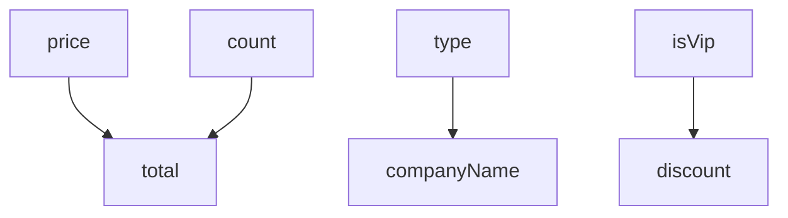

## ProForm Engine 技术设计文档（TDD）

> 本文是 `packages/vue-ui/src/ProForm` 的正式技术设计文档，面向 AI 与人类协同实现。
> 目标：在 Vue 3 + TypeScript + Zod/VeeValidate + PrimeVue 上实现企业级、无头（Headless）、Schema 驱动、类型安全的表单引擎。

---

## 1. 系统总览（System Overview）

### 1.1 五层总体架构

ProForm 系统被抽象为五个主要层级：

1. **Form Engine（Headless 引擎层）**
2. **Renderer Adapter（渲染适配层）**
3. **Layout Engine（布局引擎层）**
4. **Plugin System（插件扩展层）**
5. **Builder / Schema Tools（构建与配置工具层）**

整体层级关系如下：

```mermaid
graph TD
  A[Builder / Schema Tools] --> B[Form Engine]
  B --> C[Renderer Adapter]
  B --> D[Layout Engine]
  B --> E[Plugin System]

  subgraph Form Engine
    B1[Schema Engine]
    B2[Field Engine]
    B3[State Engine<br/>(Subscription)]
    B4[Validation Engine]
    B5[Logic Engine<br/>(visible/disabled/computed)]
    B6[Lifecycle Engine]
    B7[Dependency Graph<br/>(DAG)]
    B8[Transaction Manager]
  end

  B --> B1
  B --> B2
  B --> B3
  B --> B4
  B --> B5
  B --> B6
  B --> B7
  B --> B8

  subgraph Renderer Adapter
    C1[PrimeVueRenderer.vue]
    C2[UI Wrapper Components]
  end
```

### 1.2 “Engine ≠ UI” 原则

- **Engine 层**仅负责：Schema 解析、字段与表单状态管理、依赖图、事务、验证、逻辑调度、生命周期等纯逻辑能力。
- **Renderer 层**仅负责：将 Engine 提供的字段上下文（`useField`、`useForm` 等）映射到具体 UI 组件（PrimeVue Input、Select 等）。
- Engine 代码禁止直接依赖 DOM 或 PrimeVue 组件；所有 UI 绑定通过 **Field Registry + Renderer Adapter** 完成。

---

## 2. 核心模块（Core Modules）

本节描述 Engine 内部的四个关键模块：状态（Subscription 模型）、验证系统、字段注册表以及事务管理器。

### 2.1 State Engine（订阅式状态引擎）

#### 2.1.1 设计目标

- 避免单一巨大 `reactive(formValues)` 导致整表重渲染。
- 实现**字段级订阅（Field Subscription）**，仅更新发生变化的字段及其依赖。
- 为 Dependency Graph、Validation Engine、Renderer 提供统一的数据源。

#### 2.1.2 能力矩阵

| 能力项                    | 说明                                                        |
| ------------------------- | ----------------------------------------------------------- |
| 字段状态管理              | 维护每个字段的 `FieldState`（值、脏、触碰、验证状态等）     |
| 表单级状态管理            | 维护 `FormState`（整体值、整体有效性、提交中等）            |
| 订阅模型（Pub/Sub）       | `subscribe(fieldName, callback)`，按字段精细通知            |
| Field Array 支持          | 支持数组字段（`useFieldArray`），包含新增、删除、移动等操作 |
| Undo/Redo（可选高级能力） | 通过历史栈实现状态回滚与重做                                |

### 2.2 Validation Engine（验证引擎）

#### 2.2.1 设计目标

- 与具体验证库解耦，支持 Zod / VeeValidate / 自定义验证器。
- 统一字段级与表单级验证入口。
- 支持同步与异步验证，以及验证队列与防抖。

#### 2.2.2 能力矩阵

| 能力项     | 说明                                                           |
| ---------- | -------------------------------------------------------------- |
| 字段级验证 | 基于 `ValidationRule[]` 或 resolver 的单字段验证               |
| 表单级验证 | 基于 `ValidationResolver<TValues>` 的整体 schema 验证          |
| 异步验证   | 支持如“用户名唯一性”等异步校验，带防抖与请求取消               |
| 提交前验证 | `form.submit()` 统一触发表单级验证，再调用业务回调             |
| 跨字段验证 | 借助 `FormLogicContext` 和 Dependency Graph 进行跨字段规则计算 |

### 2.3 Registry System（字段 / 组件注册系统）

#### 2.3.1 设计目标

- 解耦 Schema 与具体 UI 组件。
- 支持按字符串 `component` 标识（如 `"input"`、`"select"`）配置字段。
- 通过注册表实现：
  - UI 组件映射（PrimeVue / 其它 UI 库）
  - `modelValue` / 事件名称映射
  - props 映射与默认配置

#### 2.3.2 核心职责

| 子模块         | 职责说明                                                        |
| -------------- | --------------------------------------------------------------- |
| Field Registry | 字段类型注册、Renderer 组件注册、value/props/event 映射         |
| Component Map  | 将字段类型映射到 PrimeVue 包装组件（例如 `PrimeInputRenderer`） |

### 2.3.3 未注册字段策略

- Schema 中的 `component` 必须映射到 `FieldRegistry` 中已注册的 PrimeVue 渲染器，或由 `field-{name}` 自定义插槽接管。
- 开发环境中，未注册字段会立即抛错，提示注册 PrimeVue renderer 或提供字段插槽。
- 生产环境中，未注册字段只渲染语义化错误提示块，不回退到原生 `<input>`，避免把应急降级误认为业务 UI 模式。

### 2.4 Transaction Manager（事务管理器）

#### 2.4.1 设计目标

- 支持在一次事务内更新多个字段，仅触发 **一次** 依赖图更新与验证/渲染。
- 避免中间不完整状态导致多次逻辑执行与性能退化。

#### 2.4.2 工作流程概述

1. `TransactionManager.begin()`：进入事务，累积字段更新。
2. 多次 `setValue(field, value)`：仅记录更新、暂不触发依赖图。
3. `TransactionManager.commit()`：
   - 计算所有受影响字段集合。
   - 执行 Dependency Graph 调度（按拓扑顺序或 BFS）。
   - 触发 Validation Engine。
   - 通知 Subscription Store，以字段级粒度通知 Renderer。

---

## 3. 字段依赖图 DAG（Form Dependency Graph）

本节定义表单依赖图的抽象结构、构建方式与调度算法。

### 3.1 问题背景

- 复杂表单中存在大量动态逻辑：
  - 计算字段：`total = price * count`
  - 条件可见：`visibleIf: form.type === 'company'`
  - 条件禁用：`disabledIf: !form.isVip`
  - 条件必填：`requiredIf: ...`
  - 动态选项：城市列表依赖省份选择
- 如果使用大量 `watch` / `computed` 在组件层到处监听字段，容易产生：
  - watch 风暴
  - 循环依赖与更新
  - O(n²) 级复杂度
  - 逻辑难以维护

### 3.2 DAG 模型

- 把每个字段抽象为一个节点 `DependencyNode`。
- 边 `A → B` 表示：字段 `B` 的逻辑依赖于字段 `A`。
- 整体结构是一个 **有向无环图（DAG）**：



### 3.3 数据结构定义

```typescript
export interface DependencyNode {
  field: string
  dependencies: Set<string> // 当前字段依赖的字段
  dependents: Set<string> // 依赖当前字段的字段
}

export class DependencyGraph {
  private nodes: Map<string, DependencyNode> = new Map()

  addNode(field: string): void {
    /* ... */
  }

  addDependency(source: string, target: string): void {
    // source 变化会影响 target
    // 即 source → target
  }

  getDependents(field: string): Set<string> {
    // 返回所有直接依赖当前字段的字段集合
    return new Set()
  }

  detectCycles(): void {
    // 使用拓扑排序或 DFS 检测环
    // 若存在循环依赖则抛出错误
  }
}
```

### 3.4 Graph 构建策略

- 构建时机：在 `useForm(schema)` 初始化期间，根据 Schema 构建 DAG。
- 推荐使用 **显式依赖声明**：

```typescript
export interface FieldSchema<TValue = any> {
  name: string
  component: string
  // ...
  deps?: string[] // 明确列出依赖的字段名
  computed?: (ctx: ComputedContext) => TValue
  visibleIf?: (ctx: FormLogicContext) => boolean
  disabledIf?: (ctx: FormLogicContext) => boolean
}
```

- 示例：

```typescript
const schema = {
  fields: [
    { name: 'price', component: 'number', defaultValue: 0 },
    { name: 'count', component: 'number', defaultValue: 1 },
    {
      name: 'total',
      component: 'number',
      deps: ['price', 'count'],
      computed: ({ form }) => form.price * form.count,
    },
    {
      name: 'companyName',
      component: 'input',
      deps: ['type'],
      visibleIf: ({ form }) => form.type === 'company',
    },
  ],
}
```

### 3.5 更新调度算法（BFS + 拓扑排序）

#### 3.5.1 触发入口

当某个字段值更新时（例如 `price`）：

1. State Engine 更新 `FieldState.value`。
2. TransactionManager 收集更新字段。
3. TransactionManager 在 `commit` 时调用 `DependencyGraph.trigger(field)`。

#### 3.5.2 BFS 调度（单源起点）

```typescript
trigger(field: string): void {
  const queue: string[] = [field]
  const visited = new Set<string>()

  while (queue.length > 0) {
    const current = queue.shift()!
    if (visited.has(current)) continue
    visited.add(current)

    // 重新计算当前字段的 computed / visibleIf / disabledIf / requiredIf
    this.recomputeFieldLogic(current)

    const dependents = this.getDependents(current)
    dependents.forEach(dep => {
      if (!visited.has(dep)) queue.push(dep)
    })
  }
}
```

#### 3.5.3 拓扑排序与循环检测

- 在初始化阶段对整图执行拓扑排序：
  - 若无法生成完整拓扑序列，说明存在环，需抛错并禁止运行。
- 运行时保证按拓扑顺序执行 `recomputeFieldLogic`，防止逻辑循环。

### 3.6 逻辑引擎集成

Dependency Graph 驱动以下逻辑：

- `computed`: 计算字段值并写回 `FieldState.value`。
- `visibleIf`: 计算字段可见性并写入内部 UI 状态。
- `disabledIf`: 计算字段是否禁用。
- `requiredIf`: 参与验证规则决策。
- `optionsLoader`: 触发动态选项加载（如城市列表依赖省份）。

---

## 4. TypeScript 类型体系（Type System）

本节统一整理 ProForm Engine 的核心 TypeScript 类型，以便 AI 直接引用与扩展。

### 4.1 Schema 相关类型

```typescript
export type LogicFunction<TValues extends Record<string, unknown> = Record<string, unknown>> = (
  ctx: LogicContext<TValues>
) => boolean

export type ComputedFunction<
  T,
  TValues extends Record<string, unknown> = Record<string, unknown>,
> = (ctx: LogicContext<TValues>) => T

export interface SelectOption {
  label: string
  value: unknown
}

export type OptionsLoader<TValues extends Record<string, unknown> = Record<string, unknown>> = (
  ctx: LogicContext<TValues>
) => Promise<SelectOption[]>

export interface FieldSchema<TValue = unknown> {
  name: string
  component: string
  label?: string
  required?: boolean
  description?: string
  defaultValue?: TValue
  transform?: (value: TValue, formValues: Record<string, unknown>) => unknown
  props?: Record<string, unknown>
  rules?: ValidationRule[]
  deps?: string[]
  visibleIf?: LogicFunction
  disabledIf?: LogicFunction
  requiredIf?: LogicFunction
  computed?: ComputedFunction<TValue>
  options?: SelectOption[] | OptionsLoader
  reactions?: FieldReaction[]
  span?: ResponsiveSpan
}

export interface GroupSchema {
  type: 'group' | 'section' | 'card' | 'collapse' | 'tabs' | 'step'
  name?: string
  label?: string
  layout?: { type: 'grid'; gap?: string; span?: ResponsiveSpan }
  children: FormSchemaNode[]
}

export type FormSchemaNode = FieldSchema | GroupSchema

export interface FormSchema {
  fields: FormSchemaNode[]
}
```

### 4.2 状态类型（FieldState / FormState）

```typescript
export interface FieldState<T = unknown> {
  value: T
  initialValue: T
  visible: boolean
  disabled: boolean
  required: boolean
  loadingOptions?: boolean
  loadedOptions?: unknown[]
  optionsError?: string
  touched: boolean
  dirty: boolean
  valid: boolean
  validating: boolean
  errors: string[]
}

export interface FormState<TValues extends Record<string, unknown> = Record<string, unknown>> {
  values: TValues
  errors: Partial<Record<keyof TValues, string[]>>
  touched: Partial<Record<keyof TValues, boolean>>
  dirty: boolean
  valid: boolean
  submitting: boolean
  submitError?: Error | null
}
```

### 4.3 上下文类型（Context）

```typescript
export interface FieldContext<T = unknown> {
  name: string
  state: FieldState<T>
  setValue: (value: T) => void
  validate: () => Promise<void>
  reset: () => void
}

export interface FormContext<TValues extends Record<string, unknown>> {
  state: FormState<TValues>
  setValue<K extends keyof TValues>(field: K, value: TValues[K]): void
  setFieldsValue(values: Partial<TValues>): void
  resetFields(names?: (keyof TValues)[]): void
  clearValidate(names?: (keyof TValues)[]): void
  setFieldProps(name: string, props: Record<string, unknown>): void
  setValidateOn(validateOn?: 'change' | 'blur' | 'submit'): void
  validate(): Promise<boolean>
  submit(): Promise<void>
  reset(): Promise<void> | void
}

/**
 * 统一的逻辑上下文类型（actual type name: LogicContext）
 * computed、visibleIf、disabledIf、requiredIf、OptionsLoader 共享此上下文
 */
export interface LogicContext<TValues extends Record<string, unknown> = Record<string, unknown>> {
  form: TValues
  field: string
}
```

### 4.4 验证相关类型

```typescript
export interface ValidationRule {
  message: string
  validator: (value: any) => boolean | Promise<boolean>
}

export interface ValidationResult {
  valid: boolean
  errors: Record<string, string[]>
}

export type ValidationResolver<TValues> = (values: TValues) => Promise<ValidationResult>
```

### 4.5 Hook 类型（useForm / useField / useFieldArray）

```typescript
export interface UseFormOptions<TValues> {
  schema: FormSchema
  initialValues?: Partial<TValues>
  resolver?: ValidationResolver<TValues>
  validateOn?: 'change' | 'blur' | 'submit'
}

export interface UseFormReturn<TValues extends Record<string, unknown>> {
  form: FormContext<TValues>
  handleSubmit: (fn: (values: TValues) => void | Promise<void>) => (e?: Event) => Promise<void>
  getValues: () => TValues
  getFormState: () => FormState<TValues>
  updateSchema: (schema: FormSchema) => void
  teardown: () => void
}

export interface UseFieldReturn<T> {
  value: Ref<T>
  state: FieldState<T>
  setValue: (v: T) => void
  validate: () => Promise<void>
}

export interface FieldArrayItem<TValue = unknown> {
  id: string
  value: TValue
  index: number
}

export interface FieldArrayReturn<TValue = unknown> {
  fields: ComputedRef<FieldArrayItem<TValue>[]>
  append: (value: TValue) => void
  remove: (index: number) => void
  move: (from: number, to: number) => void
}
```

### 4.6 渲染与注册表类型

```typescript
export interface FieldComponentProps<T = unknown> {
  modelValue: T
  disabled?: boolean
  readonly?: boolean
  error?: string[]
  loading?: boolean
  'onUpdate:modelValue': (v: T) => void
}

/**
 * 字段注册表条目（actual type: FieldRegistryItem）
 */
export interface FieldRegistryItem {
  component: Component<FieldComponentProps<unknown>>
  defaultProps?: Record<string, unknown>
  propsMapper?: (params: {
    field: FieldSchema<unknown>
    componentProps: FieldComponentProps<unknown>
  }) => Record<string, unknown>
}
```

### 4.7 ProForm 组件对外 API

```typescript
export interface ProFormProps<TValues> {
  schema: FormSchema
  modelValue?: TValues
  initialValues?: Partial<TValues>
  layout?: 'vertical' | 'horizontal' | 'inline'
  labelWidth?: string | number
  disabled?: boolean
  readonly?: boolean
  validateOn?: 'change' | 'blur' | 'submit'
  autoSave?: boolean
  persistKey?: string
}

export interface ProFormEmits<TValues> {
  (e: 'update:modelValue', v: TValues): void
  (e: 'submit', values: TValues): void
  (e: 'validate', valid: boolean): void
}
```

---

## 5. 目录规范（Directory Structure）

本节定义 `packages/vue-ui/src/ProForm` 的目标目录结构与各子目录职责，所有实现须与此保持一致。

### 5.1 顶层结构

```text
packages/vue-ui/src/ProForm/
├── index.vue                  # 顶级 ProForm 组件（外部使用入口）
├── engine/                    # 🧠 无头表单引擎（UI 无关）
│   ├── types/                 # 类型系统（Schema、State、Context、Registry 类型等）
│   ├── state/                 # Pub/Sub Store，字段/表单状态、Field Array
│   ├── registry/              # 字段/组件注册表（FieldRegistry）
│   ├── dependency/            # 字段依赖图 DAG、节点定义、调度器
│   ├── validation/            # Zod/VeeValidate 适配与 resolver 管线
│   ├── logic/                 # visibleIf / disabledIf / computed / requiredIf 等逻辑引擎
│   ├── core/                  # FormController、TransactionManager、Lifecycle 等核心控制器
│   └── hooks/                 # useForm / useField / useFieldArray / useFormContext 等 Hook
└── renderers/                 # 🎨 UI 适配层（PrimeVue 专用）
    ├── PrimeVueRenderer.vue   # 动态组件解析器，按 Schema + Registry 渲染字段
    └── components/            # 具体 PrimeVue 字段包装组件（InputText、Select 等）
```

### 5.2 Engine 子目录职责摘要

| 子目录        | 职责说明                                                               |
| ------------- | ---------------------------------------------------------------------- |
| `types/`      | 定义 Schema/State/Context/Hook/Registry 等 TS 类型与公共接口           |
| `state/`      | 实现订阅式 Store、FieldState/FormState 管理、Field Array 支持          |
| `registry/`   | 提供 `FieldRegistry` 实现，管理字段类型到 Renderer 的映射              |
| `dependency/` | 实现 Dependency Graph、节点结构与调度算法（BFS + 拓扑排序）            |
| `validation/` | 实现验证管线，适配 Zod/VeeValidate，自定义 ValidationResolver          |
| `logic/`      | 统一处理 `visibleIf` / `disabledIf` / `requiredIf` / `computed` 等逻辑 |
| `core/`       | 提供 FormController、TransactionManager、生命周期调度器                |
| `hooks/`      | 对外暴露的 Vue Hook 适配层：`useForm`、`useField`、`useFieldArray` 等  |

### 5.3 Renderer 子目录职责摘要

| 子目录 / 文件          | 职责说明                                                        |
| ---------------------- | --------------------------------------------------------------- |
| `PrimeVueRenderer.vue` | 读取 Schema + FieldRegistry + Hooks，动态选择并渲染具体字段组件 |
| `components/`          | PrimeVue 具体字段包装组件（Input、Select、DatePicker 等）       |

---

## 6. 执行与扩展指引（面向 AI 的实现顺序）

为保证实现过程可控，建议按以下阶段执行：

1. **Phase 1：基础设施**
   - 实现 `engine/types` 中的关键类型（本 TDD 已给出接口草案）。
   - 实现基础 `FieldRegistry` 与 `SubscriptionStore`（State Engine）。
2. **Phase 2：依赖图与事务系统**
   - 实现 `engine/dependency`（DependencyGraph + Scheduler）。
   - 实现 `engine/core/TransactionManager` 并与 State Engine 集成。
3. **Phase 3：Hook 层**
   - 实现 `useForm`、`useField`、`useFieldArray` 等 Hook，桥接 Engine 与 Vue 组件。
4. **Phase 4：验证集成**
   - 在 `engine/validation` 中接入 Zod/VeeValidate resolver。
5. **Phase 5：渲染层**
   - 实现 `renderers/PrimeVueRenderer.vue` 及其下的 PrimeVue 字段包装组件。

所有新增实现均必须遵守本 TDD 的：

- 架构边界：Engine 不依赖 UI；Renderer 不重新实现业务状态。
- 类型约束：以本文定义的接口为基准扩展。
- 依赖图与事务语义：更新流程必须经过 TransactionManager 与 DependencyGraph。

一、现代超级表单引擎的核心架构（必备）

顶级表单系统基本都是 4 层架构

Form Engine
│
├── Schema Layer (结构定义)
├── State Layer (表单状态)
├── Validation Layer (验证)
└── Renderer Layer (UI渲染)

也就是

Schema → State → Validation → UI

例如：

JSON Schema Form

Vueform

FormKit

FormEngine

全部都是 Schema Driven Form。

核心思想：

表单不是组件集合，而是一棵数据结构树

FormSchema
├── field
├── field
├── group
│ ├── field
│ └── field
└── array
二、顶级表单系统能力清单（必须具备）
1 Schema Driven Form（结构驱动）

这是现代 form engine 的核心

表单全部由 schema 描述

示例

{
type: 'form',
fields: [
{
name: 'username',
component: 'Input',
label: '用户名'
}
]
}

优点

动态生成表单

可存数据库

可远程配置

可生成 UI

很多库支持：

JSON Schema

自定义 schema

TS schema

例如：

Vueform

FormKit

JSONSchemaForm

Vueform 就支持 JSON → Form。

三、字段级能力（Field System）

顶级表单系统都有 Field abstraction

一个字段不是简单 input。

而是：

Field
├ label
├ component
├ props
├ rules
├ layout
├ visibility
├ events
└ meta

字段能力包括：

基础能力

字段类型

text
textarea
select
radio
checkbox
switch
date
number
password
file

高级字段

tree-select
cascader
tag-input
rich-editor
upload
map-picker
code-editor
四、布局系统（Form Layout Engine）

成熟表单系统一定有 布局引擎

例如：

grid
row
col
tabs
steps
collapse
group
card

例如：

Form
├ Grid
│ ├ Col
│ └ Col
├ Tabs
│ ├ Tab
│ └ Tab
└ StepForm

Vueform 也支持 step wizard。

五、动态逻辑系统（Dynamic Logic）

这是高级表单核心能力

支持

条件显示
visibleIf: form.age > 18
条件禁用
disabledIf: !form.isAdmin
条件校验
requiredIf: form.type === 'company'
字段联动
watch('country', () => {
loadCities()
})
computed字段
total = price \* count
六、数组 / 嵌套结构（复杂表单）

高级表单必须支持

nested object
address.city
address.zip
array
users[0].name
users[1].name
repeatable fields
Add Row
Remove Row
Move Row

例如

skills[]
phones[]
七、验证系统（Validation Engine）

你已经选 Zod + VeeValidate
这是 非常先进的组合

顶级系统支持

字段级验证
required
email
min
max
pattern
Schema验证
zod
ajv
joi

FormEngine 就支持：

Zod

AJV

Joi

异步验证
username exists
跨字段验证
password === confirmPassword
八、状态系统（Form State Engine）

一个表单引擎必须有 完整状态管理

字段状态

value
dirty
touched
valid
invalid
error
pending

表单状态

isSubmitting
isValid
isDirty
isTouched
九、组件渲染系统（UI Renderer）

一个现代表单引擎通常是

Headless Engine

UI 只是 adapter

例如

PrimeVueRenderer
AntDesignRenderer
MaterialRenderer

FormEngine 就支持：

UI-agnostic components

可以适配任何 UI 库。

十、开发体验能力（DX）

这是高级库非常重视的。

自动类型推导

TS infer

type FormData = z.infer<typeof schema>
自动表单数据
const form = useForm(schema)
自动 submit
form.submit()
十一、表单生成能力（Builder）

很多 star 高的项目都支持：

Drag Form Builder

拖拽生成表单

例如：

拖 text
拖 select
拖 group
十二、AI 表单生成（最新趋势）

现在很多系统已经支持：

AI → 表单

例如：

生成一个用户注册表单

FormKit 就支持：

prompt

screenshot

text

生成表单。

十三、企业级能力

真正企业级表单必须有：

i18n

多语言字段

Vueform 支持 19 种语言。

权限
readonly
hidden
adminOnly
表单版本
v1
v2
数据持久化
saveDraft
十四、性能优化

高端表单库都有

Field subscription

字段级更新

避免整个 form rerender。

社区也强调：

subscription-based form state management improves performance.

十五、表单生命周期

高级系统会提供 hooks

beforeSubmit
afterSubmit
beforeValidate
afterValidate
十六、数据转换

很多表单需要

formData → API data

例如

date → timestamp

所以需要

transform
serialize
deserialize
十七、远程 Schema

高级表单支持：

GET /form-schema

服务器控制 UI。

十八、插件系统

允许扩展

registerField
registerValidator
registerLayout
十九、总结：顶级超级表单能力矩阵

一个真正的 Super Form Engine

至少有：

核心能力

1 schema-driven
2 field abstraction
3 validation engine
4 form state
5 renderer adapter

进阶能力

6 dynamic logic
7 nested data
8 layout engine
9 async validation
10 field arrays

高级能力

11 form builder
12 ai form generation
13 schema persistence
14 remote schema
15 plugin system

企业能力

16 i18n
17 permission
18 versioning
19 draft
20 audit

二十、给你一个非常关键的建议

你要做的 PrimeVue ProForm

真正正确架构应该是：

ProForm
│
├── FormEngine (headless)
│ ├ schema
│ ├ state
│ ├ validation
│ └ logic
│
└── PrimeVueRenderer
├ InputRenderer
├ SelectRenderer
├ DateRenderer
└ LayoutRenderer

这样：

以后换 UI 库

不会影响表单引擎

最重要的一件事（很多人做错）

绝大部分人做表单组件是：

Form + Inputs

真正先进架构是：

Form Engine

组件只是渲染层。

下面给你的是一套 真正企业级 / 可长期演进 / UI-无关 / 类型安全 / 高性能 的 ProForm 表单引擎架构设计。
目标：在 Vue3 + TypeScript + Zod + VeeValidate + PrimeVue 基础上实现一个 Headless Form Engine + Renderer Adapter 的系统。

这套设计对标并超越：

FormKit

Vueform

React Hook Form

TanStack Form

Ant Design ProForm

目标是 真正的 Form Engine，而不是一堆组件封装。

一、整体系统架构（最终形态）

超级表单系统必须 五层结构：

ProForm
│
├── Form Engine (Headless)
│ ├── Schema Engine
│ ├── Field Engine
│ ├── State Engine
│ ├── Validation Engine
│ ├── Logic Engine
│ └── Lifecycle Engine
│
├── Renderer Adapter
│ ├── PrimeVueRenderer
│ ├── CustomRenderer
│ └── HeadlessRenderer
│
├── Layout Engine
│
├── Plugin System
│
└── Builder / Schema Tools

核心原则：

Engine ≠ UI

UI只是 Renderer。

二、最终目录架构

你项目内部建议形成一个独立 form-engine 模块

src/form-engine
│
├── core
│ ├── createForm.ts
│ ├── formContext.ts
│ ├── formLifecycle.ts
│ └── formStore.ts
│
├── schema
│ ├── formSchema.ts
│ ├── fieldSchema.ts
│ ├── layoutSchema.ts
│ └── schemaUtils.ts
│
├── state
│ ├── fieldState.ts
│ ├── formState.ts
│ ├── subscription.ts
│ └── stateMachine.ts
│
├── validation
│ ├── zodValidator.ts
│ ├── veeAdapter.ts
│ └── asyncValidator.ts
│
├── logic
│ ├── computed.ts
│ ├── watch.ts
│ ├── visibility.ts
│ └── dependencyGraph.ts
│
├── renderer
│ ├── rendererRegistry.ts
│ └── renderField.ts
│
├── layouts
│ ├── gridLayout.ts
│ ├── tabsLayout.ts
│ └── stepLayout.ts
│
├── plugins
│ ├── pluginSystem.ts
│ └── pluginHooks.ts
│
└── types
├── formTypes.ts
├── fieldTypes.ts
└── rendererTypes.ts
三、核心 API 设计
createForm

表单实例

const form = createForm({
schema,
initialValues,
validator: zodResolver(schema),
})

返回：

form.values
form.errors
form.meta
form.submit()
form.reset()
form.validate()
四、Schema System（表单结构系统）

现代表单必须 Schema Driven

FormSchema
interface FormSchema {
fields: FieldSchema[]
layout?: LayoutSchema
}
FieldSchema

字段必须是 抽象节点

interface FieldSchema {

name: string

component: string

label?: string

props?: Record<string, any>

defaultValue?: any

rules?: ValidationRule[]

visible?: LogicExpression

disabled?: LogicExpression

computed?: ComputedExpression

layout?: LayoutProps
}
LayoutSchema
type LayoutSchema =
| GridLayout
| TabsLayout
| StepsLayout
| GroupLayout
五、Field Engine（字段引擎）

字段是整个系统核心。

每个字段都有 FieldState

interface FieldState {

value

initialValue

dirty

touched

valid

invalid

error

pending

}
六、State Engine（高性能状态管理）

如果你想达到 React Hook Form / TanStack Form 的性能

必须使用：

Subscription state model

而不是：

reactive(form)

推荐实现：

subscribe(fieldName, callback)

只更新对应字段。

formStore
const store = createFormStore()

store.setValue(name, value)

store.getValue(name)

store.subscribe(name)
七、Validation Engine

你选的组合非常好：

Zod

VeeValidate

建议结构：

validation
├ zodResolver
├ veeAdapter
├ asyncValidator
validator pipeline
fieldChange
↓
sync validation
↓
async validation
↓
update error state
八、Logic Engine（动态逻辑引擎）

顶级表单必须有 动态逻辑

支持能力
visibleIf
disabledIf
requiredIf
computed
watch
computed字段
computed: ({ form }) => form.price \* form.count
条件显示
visible: ({ form }) => form.type === 'company'
九、Dependency Graph（依赖图）

复杂表单需要 依赖图系统

price ─┐
├─ total
count ─┘

字段更新只触发依赖节点。

十、Renderer Adapter（UI适配层）

这是连接 PrimeVue

你需要一个 Renderer Registry

rendererRegistry
registerRenderer('input', PrimeInputRenderer)

registerRenderer('select', PrimeSelectRenderer)

registerRenderer('date', PrimeDateRenderer)
renderField
const renderer = registry.get(field.component)

return h(renderer, props)
十一、PrimeVue Renderer

你可以写一层：

src/form-renderers

例如：

PrimeInputRenderer.vue
PrimeSelectRenderer.vue
PrimeDateRenderer.vue
PrimeSwitchRenderer.vue
PrimeUploadRenderer.vue

这些组件只负责：

props
emit
modelValue
十二、Layout Engine

高级表单必须支持复杂布局。

推荐支持：

Grid
Tabs
Steps
Collapse
Group
Card
Grid schema
{
type: 'grid',
columns: 12,
children: [...]
}
十三、Field Array（动态数组）

必须支持

phones[]
skills[]
users[]

操作：

add()
remove()
move()
十四、Lifecycle Hooks
onFormInit
onFieldChange
beforeValidate
afterValidate
beforeSubmit
afterSubmit
十五、Plugin System

插件系统是高级能力。

registerPlugin(plugin)

插件可以：

registerField
registerValidator
registerLayout
registerRenderer
十六、表单 Builder

未来你可以做：

拖拽表单生成。

Schema Editor

生成：

FormSchema JSON
十七、TypeScript 类型系统

利用 Zod：

const schema = z.object({
name: z.string(),
age: z.number()
})

推导：

type FormData = z.infer<typeof schema>

表单 API：

createForm<FormData>()
十八、数据转换系统

很多表单需要：

serialize
deserialize
transform

例如：

date → timestamp
十九、远程 Schema

高级系统支持：

GET /form-schema

服务器控制 UI。

二十、性能优化

必须做：

field subscription

避免整个 form rerender。

lazy mount

复杂表单延迟渲染。

async validator debounce

避免请求风暴。

二十一、最终能力矩阵

一个顶级 ProForm 应该支持：

核心

schema form

field abstraction

form state

validation engine

renderer adapter

进阶

dynamic logic

nested fields

field arrays

layout engine

高级

dependency graph

plugin system

remote schema

form builder

企业

i18n

permission

draft

versioning

二十二、最终组件 API（你未来的使用方式）

理想的最终用法：

<ProForm
:schema="schema"
:initialValues="data"
@submit="handleSubmit"
/>

字段：

{
name: 'username',
component: 'input',
label: '用户名',
rules: ['required']
}
二十三、最重要的设计原则

真正顶级表单系统必须：

1️⃣ Engine 与 UI 解耦
2️⃣ Schema 驱动
3️⃣ 类型安全
4️⃣ 字段级状态订阅
5️⃣ 可扩展插件系统

一、Hook 层在架构中的位置

完整结构应该是：

Form Engine (headless core)
│
├─ formStore
├─ fieldEngine
├─ validationEngine
└─ logicEngine
│
▼
Hooks / Composables Layer
│
├─ useForm
├─ useField
├─ useFieldArray
├─ useFormContext
└─ useFormMeta
│
▼
Renderer Components
│
└─ PrimeVue components

所以：

Hook = Engine API 的 Vue 封装

二、最核心的 5 个 Hooks（必须有）

这是我建议的 最精简但完整的一组 hooks。

1️⃣ useForm

表单实例入口。

const form = useForm({
schema,
initialValues
})

返回：

form.values
form.errors
form.meta
form.submit()
form.reset()
form.validate()

作用：

创建 form engine

提供 context

管理生命周期

2️⃣ useFormContext

在任何子组件获取 form。

const form = useFormContext()

类似：

React Hook Form 的 useFormContext

FormKit 的 useForm

作用：

避免 props drilling。

3️⃣ useField

字段核心 hook。

const field = useField('username')

返回：

field.value
field.error
field.meta
field.setValue()
field.validate()

字段状态：

meta = {
dirty
touched
valid
pending
}

Renderer 就是通过它绑定 UI。

4️⃣ useFieldArray

数组字段。

const { fields, add, remove, move } =
useFieldArray('users')

能力：

add()
remove()
move()
swap()

用于：

skills[]
phones[]
users[]
5️⃣ useFormMeta

获取表单整体状态。

const meta = useFormMeta()

返回：

isDirty
isValid
isSubmitting
isValidating

用于：

submit button disabled
三、进阶 Hooks（推荐）

如果想做成真正高级系统，可以再加 5 个。

useWatch

监听字段。

const country = useWatch('country')

类似：

watch(form.country)

适合：

动态表单逻辑。

useComputedField

计算字段。

useComputedField('total', ({ form }) => {
return form.price \* form.count
})

自动更新。

useFormValues

获取整个表单值。

const values = useFormValues()

用于：

复杂逻辑。

useFormErrors

获取所有错误。

const errors = useFormErrors()
useFieldMeta

只订阅字段状态。

const meta = useFieldMeta('email')

避免重新渲染。

四、Hook 目录建议

建议放在：

src/form-engine/hooks

结构：

hooks
├─ useForm.ts
├─ useFormContext.ts
├─ useField.ts
├─ useFieldArray.ts
├─ useFormMeta.ts
│
├─ useWatch.ts
├─ useComputedField.ts
├─ useFormValues.ts
└─ useFieldMeta.ts
五、Hook 与 Renderer 的关系

PrimeVue Renderer 组件会这样用：

const field = useField(props.name)

然后绑定：

<InputText
  v-model="field.value"
/>

<span>{{ field.error }}</span>

Renderer 不需要知道：

schema

validation

form store

只关心 field。

六、为什么 hooks 非常重要

没有 hooks：

ProForm
└ Field
└ Renderer
└ props

会变成 巨大 props 传递链。

有 hooks：

Renderer
└ useField()

直接从 context 获取状态。

七、Hook 设计的关键原则

建议遵循 4 个原则：

1️⃣ Hook 只读 Engine

不要在 Hook 里写逻辑。

Hook 只是 adapter。

2️⃣ Hook 必须可组合
useField
useFieldMeta
useWatch

都可以组合。

3️⃣ Hook 必须订阅最小状态

避免：

reactive(form)

否则整个表单重渲染。

4️⃣ Hook API 尽量稳定

Engine 可以升级。

Hook API 尽量不变。

八、最终推荐 Hook 体系

我建议你的 ProForm 最终 hooks：

核心
useForm
useFormContext
useField
useFieldArray
useFormMeta
进阶
useWatch
useComputedField
useFormValues
useFormErrors
useFieldMeta

总共 10 个 hooks。

这是一个 非常干净且强大的体系。

九、一个非常关键的设计建议（很多人会忽略）

不要把 hooks 写在：

src/hooks

而是：

src/form-engine/hooks

原因：

它属于引擎的一部分，而不是项目工具。

如果你愿意，我可以再补充 一个非常关键但很多人忽略的东西：

Form Engine 的 “Field 注册系统（Field Registry）”

如果不设计这个，你的 ProForm 后期扩展会非常痛苦。
这个东西其实是 Ant Design ProForm、FormKit、TanStack Form 的核心扩展点。

请帮我补充

很好，这一部分其实是 真正决定你的 ProForm 是否能长期扩展的关键设计。
很多表单系统失败的原因就是 没有 Field Registry（字段注册系统），导致：

新字段无法扩展

Renderer 与 Schema 强耦合

插件系统无法实现

像 FormKit、TanStack Form、Ant Design ProForm 都有类似的 字段注册机制。

下面给你的是 完整可落地的 Field Registry 架构设计。

一、为什么必须有 Field Registry

如果没有 registry，你的 schema 会变成这样：

{
name: "username",
component: InputText
}

问题：

1️⃣ schema 与 UI 强耦合
2️⃣ 无法做远程 schema
3️⃣ 无法插件扩展
4️⃣ 无法动态加载字段

正确做法：

{
name: "username",
component: "input"
}

然后由 Field Registry 决定：

input -> PrimeInputRenderer
二、Field Registry 的核心职责

Field Registry 实际上负责 5 件事情

Field Registry
│
├── field type 注册
├── renderer 注册
├── props mapping
├── value mapping
└── default config
三、最终 FieldRegistry 架构

建议你设计成：

form-engine
│
├── field-registry
│ ├── registry.ts
│ ├── registerField.ts
│ ├── getField.ts
│ └── fieldTypes.ts
四、Field Definition（字段定义）

字段在 registry 中不是简单 renderer，而是一个 FieldDefinition

建议结构：

interface FieldDefinition {

type: string

renderer: Component

valueProp?: string

event?: string

propsMapper?: (schemaProps) => any

defaultProps?: Record<string, any>

}

解释：

属性 作用
type 字段类型
renderer UI组件
valueProp v-model属性
event 更新事件
propsMapper schema → props
defaultProps 默认配置
五、Field Registry 实现
registry.ts
const registry = new Map<string, FieldDefinition>()

export function registerField(def: FieldDefinition) {
registry.set(def.type, def)
}

export function getField(type: string) {
return registry.get(type)
}
六、注册字段

例如 PrimeVue input

registerField({
type: "input",
renderer: PrimeInputRenderer,
valueProp: "modelValue",
event: "update:modelValue"
})

select

registerField({
type: "select",
renderer: PrimeSelectRenderer
})

date

registerField({
type: "date",
renderer: PrimeDateRenderer
})
七、Schema 如何使用

schema 中：

{
name: "username",
component: "input",
label: "用户名"
}

Renderer 会：

schema.component
↓
FieldRegistry
↓
renderer component
八、Renderer 渲染流程

渲染逻辑：

SchemaField
│
▼
getField(schema.component)
│
▼
renderer
│
▼
PrimeVue Component

代码：

const fieldDef = getField(schema.component)

const Renderer = fieldDef.renderer

return h(Renderer, props)
九、Value Mapping（关键设计）

不同 UI 组件的 value API 不一样。

例如：

PrimeVue Input
modelValue
update:modelValue
Select
modelValue
update:modelValue
Switch
checked
update:checked

FieldRegistry 可以统一：

{
valueProp: "checked",
event: "update:checked"
}

Renderer 自动绑定。

十、Props Mapping

schema：

{
component: "select",
options: [...]
}

PrimeVue：

<Select :options="options" />

通过 mapper：

propsMapper: (schema) => ({
options: schema.options
})
十一、Default Props

统一字段默认行为：

defaultProps: {
clearable: true
}
十二、Field Registry + Hooks 工作流程

完整流程：

useField(name)
│
▼
FieldEngine
│
▼
SchemaField
│
▼
FieldRegistry.get(type)
│
▼
Renderer
│
▼
PrimeVue component
十三、Registry 让插件系统成为可能

插件可以注册新字段：

registerField({
type: "markdown",
renderer: MarkdownEditor
})

schema 立即支持：

{
component: "markdown"
}

无需修改核心代码。

十四、Registry + Lazy Loading（高级）

可以支持：

renderer: () => import("./RichEditor")

实现：

表单字段按需加载。

十五、最终 Field Registry API

建议提供三个 API：

registerField(def)

getField(type)

hasField(type)
十六、建议默认内置字段

建议默认支持：

input
textarea
number
select
radio
checkbox
switch
date
time
upload
slider
rate
十七、Layout Registry（进阶）

同样思想也可以用于：

LayoutRegistry

注册：

grid
tabs
steps
group
card
十八、Validator Registry（进阶）

未来可扩展：

ValidatorRegistry

支持：

required
email
phone
url
十九、最终系统结构（完整版）

你的 ProForm Engine 最终结构：

form-engine
│
├── core
├── schema
├── state
├── validation
├── logic
├── hooks
│
├── field-registry
│
├── renderer
│
├── layouts
│
└── plugins
二十、这一层设计带来的巨大优势

你的 ProForm 会获得：

1 可扩展字段系统

任何组件都能注册。

2 UI 库可替换

PrimeVue → NaiveUI → ElementPlus
只换 renderer。

3 支持远程 schema

因为 schema 不包含组件。

4 支持插件生态

第三方组件可注册。

5 支持 Builder

拖拽表单生成 schema。

最后一个非常重要的建议（关键）

你的 FieldRegistry 一定不要只存 renderer。

正确设计是：

FieldDefinition

否则后期：

value mapping

prop mapping

validation

meta

全部无法扩展。

下面这部分是 表单引擎架构里最容易被忽略，但决定复杂表单性能与可维护性的核心模块：
Form Dependency Graph（字段依赖图）。

很多项目在这里犯的错误是：
用 watch 或 computed 到处监听表单字段。
当字段多了以后就会出现：

watch 风暴

循环更新

性能灾难

逻辑混乱

顶级表单系统（例如 TanStack Form 和 React Hook Form）都会实现 依赖图调度机制。

一、什么是 Form Dependency Graph

依赖图本质上是一个 DAG（Directed Acyclic Graph）

表示：

字段之间的依赖关系

例如：

price ─┐
├── total
count ─┘

意思：

total = price \* count

当：

price change

只触发：

total recompute

而不是整个 form 重新计算。

二、依赖图解决的核心问题

Dependency Graph 解决 4 类动态表单逻辑

1️⃣ computed fields
total = price \* count
2️⃣ dynamic visible
visibleIf: form.type === 'company'
3️⃣ dynamic validation
requiredIf: form.country === 'china'
4️⃣ dynamic options
city options ← province
三、为什么不能直接用 watch

错误设计：

watch(() => form.price, ...)
watch(() => form.count, ...)
watch(() => form.type, ...)

如果有 50 个字段：

可能会产生 几百个 watch。

问题：

复杂度接近 O(n²)

Dependency Graph 可以把复杂度降到：

O(k)

k = 实际依赖字段。

四、Dependency Graph 架构

建议单独模块：

form-engine
└ dependency
├ dependencyGraph.ts
├ dependencyNode.ts
└ scheduler.ts
五、Dependency Node 设计

每个字段是一个节点：

interface DependencyNode {

field: string

dependents: Set<string>

dependencies: Set<string>

}

含义：

字段 含义
field 当前字段
dependencies 依赖谁
dependents 谁依赖它

示例：

price
dependents -> total
total
dependencies -> price,count
六、Dependency Graph 数据结构

推荐：

class DependencyGraph {

nodes: Map<string, DependencyNode>

}
七、Graph 构建流程

在 schema 解析阶段建立。

例如 schema：

{
name: "total",
computed: ({ form }) => form.price \* form.count
}

解析依赖：

total
├ price
└ count

加入 graph。

八、Graph 构建示例

最终 graph：

price
↓
total
↑
count

数据结构：

price
dependents -> total

count
dependents -> total

total
dependencies -> price,count
九、Graph 更新流程

当字段更新：

price change

流程：

1 找到 dependents
2 按顺序 recompute
3 更新 state

流程图：

price change
│
▼
dependencyGraph
│
▼
find dependents
│
▼
recompute
│
▼
update state
十、Graph 调度算法

推荐使用 BFS 更新

示例：

price change

队列：

queue = [price]

执行：

while queue
node = queue.pop
recompute dependents
push next dependents
十一、避免循环依赖

例如：

a → b
b → c
c → a

必须检测。

解决方案：

拓扑排序

如果无法排序：

throw Error("Circular dependency")
十二、Schema 中的依赖声明

有两种方式：

自动推断（高级）

解析 computed 函数：

form.price
form.count

缺点：

实现复杂。

显式声明（推荐）
{
name: "total",
computed: ({ form }) => form.price \* form.count,
deps: ["price","count"]
}

更稳定。

十三、Dependency Graph + Logic Engine

Dependency Graph 不只是 computed。

还驱动：

visible
companyName
visibleIf: type === "company"
deps: ["type"]
disabled
discount
disabledIf: !isVip
deps: ["isVip"]
required
companyId
requiredIf: type === "company"
deps: ["type"]
十四、完整字段 schema 示例

未来 schema 可以这样：

{
name: "total",

component: "number",

computed: ({ form }) => form.price \* form.count,

deps: ["price","count"]
}

另一个：

{
name: "companyName",

component: "input",

visibleIf: ({ form }) => form.type === "company",

deps: ["type"]
}
十五、Dependency Graph + Hooks

hooks 会触发 graph。

例如：

useField("price").setValue()

流程：

setValue
│
▼
formStore update
│
▼
dependencyGraph.trigger("price")
│
▼
recompute dependents
十六、Dependency Graph + 性能

如果没有 graph：

form update → recompute all logic

复杂度：

O(n)

有 graph：

price change → only recompute dependents

复杂度：

O(k)

k = 依赖节点数量。

十七、Graph + Renderer 更新

当 computed 更新：

total change

触发：

field subscription

只有：

total renderer

重新渲染。

十八、Graph + Async Logic

还可以支持：

province → fetch city options

schema：

{
name: "city",

optionsLoader: async ({ form }) => {
return fetchCity(form.province)
},

deps: ["province"]
}
十九、最终系统结构（加入 Graph）

你的 form-engine 最终结构：

form-engine
│
├ core
├ schema
├ state
├ validation
├ logic
│
├ dependency
│ ├ dependencyGraph.ts
│ ├ scheduler.ts
│ └ dependencyNode.ts
│
├ hooks
├ renderer
├ field-registry
└ plugins
二十、Dependency Graph 是什么级别的设计

如果实现了：

Field Registry

Dependency Graph

Schema Engine

Hook Layer

你的 ProForm 本质上已经是：

完整 Form Engine

架构级别接近：

FormKit

TanStack Form

最后补一句真正的架构经验

很多人做表单组件：

Form + Input

而真正高级系统是：

Form Engine

核心是：

Schema
State
Dependency Graph
Renderer

而 UI 只是最后一层。

目标是你实现的 ProForm Engine 最终具备和：

TanStack Form

FormKit

React Hook Form

同级别甚至更高级的架构能力。

一、Form Engine 完整模块架构

一个真正顶级的表单引擎最终结构应该是：

form-engine
│
├ core
│ ├ formController.ts
│ ├ lifecycle.ts
│ └ transaction.ts
│
├ schema
│ ├ schemaParser.ts
│ ├ schemaNormalizer.ts
│ └ schemaTypes.ts
│
├ state
│ ├ formStore.ts
│ ├ fieldStore.ts
│ └ subscription.ts
│
├ dependency
│ ├ dependencyGraph.ts
│ ├ scheduler.ts
│ └ node.ts
│
├ validation
│ ├ validationEngine.ts
│ ├ validationResolver.ts
│ └ asyncValidator.ts
│
├ renderer
│ ├ formRenderer.ts
│ └ fieldRenderer.ts
│
├ registry
│ ├ fieldRegistry.ts
│ └ componentRegistry.ts
│
├ hooks
│ ├ useForm.ts
│ ├ useField.ts
│ ├ useFieldArray.ts
│ └ useFormContext.ts
│
├ logic
│ ├ visibilityEngine.ts
│ ├ disableEngine.ts
│ └ computedEngine.ts
│
├ transaction
│ ├ transactionManager.ts
│ └ batchScheduler.ts
│
├ persistence
│ ├ draftStorage.ts
│ └ formSerializer.ts
│
├ devtools
│ └ formInspector.ts
│
└ plugins
└ pluginSystem.ts
二、Form Transaction System（表单事务系统）

这是 高级表单系统的核心优化机制。

解决问题：

一次更新多个字段
避免中间状态触发逻辑
避免多次 render
避免重复 validation
1 事务示例

普通更新：

setValue("price",100)
setValue("count",2)

会触发：

computed
validation
render

两次。

事务模式：

form.transaction(() => {

setValue("price",100)
setValue("count",2)

})

只触发一次：

computed
validation
render
2 Transaction API

设计：

form.transaction((tx)=>{

tx.setValue("price",100)

tx.setValue("count",2)

})
3 Transaction Manager

核心结构：

class TransactionManager {

private depth = 0

private pendingUpdates = new Set<string>()

}

逻辑：

begin transaction
↓
collect updates
↓
commit
↓
run dependency graph
↓
run validation
↓
notify renderer
三、Form Subscription System（订阅系统）

这是 高性能表单 UI 的核心机制。

如果没有 subscription：

form change
↓
entire form rerender

正确方式：

field subscribe

每个字段监听自己的状态。

设计：

interface FieldSubscriber {

field: string

callback: () => void

}

store：

Map<field,Set<subscriber>>

更新：

price change
↓
notify(price subscribers)
四、Field Registry（字段注册系统）

解决：

component ←→ schema 解耦

例如 schema：

component: "input"

通过 registry：

input → PrimeInputText

registry：

const fieldRegistry = new Map()

注册：

registerField("input",InputField)
五、Field Lifecycle System（字段生命周期）

每个字段都有生命周期：

mount
update
unmount
validate
submit

hook：

onFieldMount
onFieldUnmount
onFieldChange

用于：

async load
side effect
plugin
六、Dynamic Field Array Engine

复杂表单必须支持：

array field

例如：

users[0].name
users[1].name

核心 API：

useFieldArray

操作：

append
remove
move
swap
insert

内部实现：

array index mapping
stable keys

避免：

index shifting bugs
七、Schema Normalization Engine

schema 在运行前必须 标准化。

原因：

用户 schema 可能非常简写。

输入：

{
name:"username"
}

normalize：

{
name:"username",
component:"input",
visible:true,
disabled:false,
validation:[],
deps:[]
}
八、Logic Engine（表单逻辑引擎）

统一处理：

visibleIf
disabledIf
requiredIf
computed

结构：

logicEngine
│
├ visibility
├ disable
├ required
└ computed

由 dependency graph 驱动。

九、Validation Engine

验证系统必须 完全解耦。

支持：

zod
custom
async

resolver模式：

validateResolver(schema)

支持：

field validation
form validation
submit validation
十、Async Validation Queue

解决：

username uniqueness check

设计：

debounce
cancel previous request

结构：

validationQueue
十一、Form Persistence（表单持久化）

高级系统支持：

draft save
auto restore

API：

form.persist("localStorage")

数据：

formValues
dirtyState
十二、Undo / Redo System

高级表单可以支持：

undo
redo

设计：

history stack
past
present
future

API：

form.undo()

form.redo()
十三、Form Serializer

表单提交时：

需要序列化：

formValues

例如：

Date
File
Map

需要转换。

serializer：

form.serialize()
十四、Form DevTools

高级系统必须支持：

form debug panel

可以查看：

form state
dependency graph
validation
subscriptions

类似：

React DevTools。

十五、Plugin System（插件系统）

顶级架构必须可扩展。

插件：

analytics plugin
i18n plugin
storage plugin

插件接口：

interface FormPlugin {

install(form)

}

安装：

form.use(plugin)
十六、Renderer Virtualization

如果表单：

200 fields

必须支持：

virtual render

只渲染：

visible fields
十七、Schema Lazy Loading

复杂表单：

step form

schema可以：

lazy load
十八、Form Layout Engine

高级表单支持：

grid layout
tabs
steps
groups

schema：

group
section
step
十九、Access Control Engine

企业系统必须支持：

permission control

字段：

editable
readonly
hidden
二十、Internationalization

表单支持：

validation message
label
placeholder

i18n。

二十一、Field Event Bus

表单事件系统：

field:change
field:focus
field:blur
form:submit

event bus：

on
emit
二十二、Advanced Computed Fields

computed不仅仅：

price \* count

还可以：

async computed

例如：

exchange rate
二十三、Conditional Schema

schema本身可以动态：

type === company

插入字段。

二十四、Field Mask Engine

输入格式化：

phone
currency
credit card
二十五、Auto Save Engine

复杂表单：

auto save

例如：

every 10s
二十六、Optimistic Update System

表单提交：

optimistic UI
二十七、Accessibility Engine

支持：

ARIA
keyboard navigation
screen reader
二十八、Error Boundary System

表单渲染错误：

fallback UI
二十九、Field Performance Isolation

字段独立更新：

micro rendering
三十、最终你这个 ProForm Engine 的能力

如果实现上述架构，你的系统将具备：

Schema Engine
Dependency Graph
Transaction System
Subscription Store
Field Registry
Plugin System
Validation Engine
Async Engine
Persistence
DevTools
Layout Engine
Permission Engine

这已经不是：

form component

而是：

Form Platform
最关键的一句话（架构层面）

真正顶级的表单系统核心不是 UI，而是：

Form Engine

而 UI 只是：

Renderer Adapter

下面给你一套 真正可以落地的 ProForm Engine TypeScript 类型系统设计。
目标是做到 100% 类型安全、Schema 推导表单值、字段级类型提示、组件级类型约束。

这一套类型体系的设计思路接近：

TanStack Form

React Hook Form

FormKit

但我会按 Vue3 + TS + Schema Engine 的最佳架构给你设计。

一、整体类型系统架构

ProForm Engine 类型体系应该分为 7层

types
│
├ schema
│ ├ fieldSchema.ts
│ ├ groupSchema.ts
│ └ formSchema.ts
│
├ state
│ ├ fieldState.ts
│ └ formState.ts
│
├ context
│ ├ fieldContext.ts
│ └ formContext.ts
│
├ hooks
│ ├ useForm.ts
│ ├ useField.ts
│ └ useFieldArray.ts
│
├ renderer
│ └ fieldComponent.ts
│
├ registry
│ └ fieldRegistry.ts
│
└ props
└ proFormProps.ts

核心目标：

Schema → 自动推导 → FormValues 类型
二、Schema 核心类型

Schema 是整个系统的核心。

FieldSchema
export interface FieldSchema<TValue = any> {

name: string

component: string

label?: string

defaultValue?: TValue

props?: Record<string, any>

rules?: ValidationRule[]

deps?: string[]

visibleIf?: LogicFunction

disabledIf?: LogicFunction

requiredIf?: LogicFunction

computed?: ComputedFunction<TValue>

options?: SelectOption[] | OptionsLoader

}
逻辑函数类型
export type LogicFunction = (ctx: FormLogicContext) => boolean
computed 类型
export type ComputedFunction<T> = (ctx: ComputedContext) => T
OptionsLoader
export type OptionsLoader =
(ctx: OptionsLoaderContext) => Promise<SelectOption[]>
三、Group Schema

用于：

section
group
step
export interface GroupSchema {

type: "group" | "section" | "step"

label?: string

children: FormSchemaNode[]

}
四、FormSchemaNode

Schema节点可以是：

field
group
export type FormSchemaNode =
| FieldSchema
| GroupSchema
五、FormSchema
export interface FormSchema {

fields: FormSchemaNode[]

}
六、FormValues 自动推导

这是 整个类型系统最关键的能力。

目标：

const schema = {
fields:[
{name:"username"},
{name:"age"}
]
}

自动得到：

type FormValues = {
username:string
age:number
}
类型推导工具
type FieldValue<S> =
S extends FieldSchema<infer T> ? T : never
提取字段
type ExtractFieldNames<T> =
T extends { name: infer N }
? N
: never
Schema → Values
type SchemaToValues<T extends FieldSchema[]> = {

[K in T[number] as K["name"]]: FieldValue<K>

}
七、FieldState 类型

每个字段状态：

export interface FieldState<T = any> {

value: T

initialValue: T

touched: boolean

dirty: boolean

valid: boolean

validating: boolean

errors: string[]

}
八、FormState 类型
export interface FormState<TValues = any> {

values: TValues

errors: Partial<Record<keyof TValues,string[]>>

touched: Partial<Record<keyof TValues,boolean>>

dirty: boolean

valid: boolean

submitting: boolean

}
九、FieldContext

组件层使用。

export interface FieldContext<T = any> {

name: string

state: FieldState<T>

setValue: (value:T)=>void

validate: ()=>Promise<void>

reset: ()=>void

}
十、FormContext
export interface FormContext<TValues> {

state: FormState<TValues>

setValue<K extends keyof TValues>(
field:K,
value:TValues[K]
):void

validate():Promise<boolean>

submit():Promise<void>

reset():void

}
十一、useForm Hook 类型
export interface UseFormOptions<TValues> {

schema: FormSchema

initialValues?: Partial<TValues>

resolver?: ValidationResolver<TValues>

validateOn?:

    | "change"
    | "blur"
    | "submit"

}

返回：

export interface UseFormReturn<TValues> {

form: FormContext<TValues>

handleSubmit: (
fn:(values:TValues)=>void
) => (e:Event)=>void

}
十二、useField Hook
export interface UseFieldOptions<T> {

name:string

}

返回：

export interface UseFieldReturn<T> {

value: Ref<T>

state: FieldState<T>

setValue:(v:T)=>void

}
十三、useFieldArray 类型
export interface FieldArrayReturn<T> {

fields: Ref<T[]>

append:(value:T)=>void

remove:(index:number)=>void

move:(from:number,to:number)=>void

}
十四、FieldComponent 类型

用于 组件注册系统。

export interface FieldComponentProps<T = any> {

modelValue: T

disabled?: boolean

readonly?: boolean

error?: string[]

onUpdate:modelValue:(v:T)=>void

}
十五、FieldRegistry 类型
export interface FieldRegistry {

register<T>(
name:string,
component:Component<FieldComponentProps<T>>
):void

get(name:string):Component

}
十六、ValidationRule 类型
export interface ValidationRule {

message:string

validator:(value:any)=>boolean | Promise<boolean>

}
十七、ValidationResolver

用于 Zod。

export type ValidationResolver<T> =
(values:T)=>Promise<ValidationResult>
十八、ValidationResult
export interface ValidationResult {

valid:boolean

errors:Record<string,string[]>

}
十九、Computed Context
export interface ComputedContext<TValues=any> {

form:TValues

field:string

}
二十、Logic Context
export interface FormLogicContext<TValues=any> {

form:TValues

field:string

}
二十一、ProForm 组件 Props

真正对外暴露的 表单组件 API。

export interface ProFormProps<TValues> {

schema:FormSchema

modelValue?:TValues

initialValues?:Partial<TValues>

layout?:
| "vertical"
| "horizontal"
| "inline"

labelWidth?:string | number

disabled?:boolean

readonly?:boolean

validateOn?:
| "change"
| "blur"
| "submit"

autoSave?:boolean

persistKey?:string

}
二十二、ProForm 组件 Emits
export interface ProFormEmits<TValues> {

(e:"update:modelValue",v:TValues):void

(e:"submit",values:TValues):void

(e:"validate",valid:boolean):void

}
二十三、Field Slot Props

如果支持 slot：

export interface FieldSlotProps<T> {

value:T

state:FieldState<T>

setValue:(v:T)=>void

}
二十四、Layout Schema

如果支持布局：

export interface LayoutSchema {

type:

    | "grid"
    | "row"
    | "tabs"
    | "steps"

columns?:number

}
二十五、完整使用示例（类型自动推导）
const schema = {

fields:[
{
name:"username",
component:"input",
defaultValue:""
},
{
name:"age",
component:"number",
defaultValue:0
}
]

} as const

useForm：

const {form} = useForm<typeof schema>()

自动得到：

form.values.username -> string
form.values.age -> number
二十六、最终 ProForm Engine 的 TS 能力

如果按照这套类型体系实现：

你将获得：

Schema 类型安全
字段类型推导
组件类型约束
Hook 类型提示
FormValues 自动生成

类型体验接近：

tRPC级别

开发体验：

IDE 自动推导字段类型
最后给你一个真正关键的架构建议

如果你要做 真正顶级的 ProForm Engine
类型系统必须再加一层：

Schema Builder DSL

例如：

formSchema({

username: field.string(),

age: field.number(),

})

这样可以做到：

100% 类型安全

并且：

Schema → 自动推导 FormValues

这是一次性全套顶级方案，不留后续扩展坑。

一、ProForm Engine 目录结构
pro-form-engine/
│
├─ core/ # 核心引擎逻辑
│ ├ formController.ts # Form 控制器，管理 state、schema、transaction
│ ├ transactionManager.ts # 表单事务系统
│ ├ lifecycle.ts # 字段/表单生命周期管理
│ └ scheduler.ts # 依赖调度器，触发依赖图更新
│
├─ schema/ # schema 解析、规范化、类型系统
│ ├ fieldSchema.ts
│ ├ groupSchema.ts
│ ├ layoutSchema.ts
│ ├ schemaNormalizer.ts
│ └ formSchema.ts
│
├─ state/ # 状态管理
│ ├ formStore.ts
│ ├ fieldStore.ts
│ ├ fieldArrayStore.ts
│ └ subscriptionStore.ts
│
├─ dependency/ # 字段依赖图
│ ├ dependencyGraph.ts
│ ├ dependencyNode.ts
│ └ scheduler.ts
│
├─ validation/ # 验证系统
│ ├ validationEngine.ts
│ ├ validationResolver.ts
│ ├ asyncValidator.ts
│ └ rules.ts
│
├─ renderer/ # 渲染层
│ ├ fieldRenderer.ts
│ └ formRenderer.ts
│
├─ registry/ # 字段/组件注册系统
│ ├ fieldRegistry.ts
│ └ componentRegistry.ts
│
├─ hooks/ # 高级 hook 封装
│ ├ useForm.ts
│ ├ useField.ts
│ ├ useFieldArray.ts
│ └ useFormContext.ts
│
├─ logic/ # 可见性/禁用/计算逻辑引擎
│ ├ visibilityEngine.ts
│ ├ disableEngine.ts
│ ├ requiredEngine.ts
│ └ computedEngine.ts
│
├─ persistence/ # 持久化和序列化
│ ├ draftStorage.ts
│ └ formSerializer.ts
│
├─ devtools/ # 调试工具
│ └ formInspector.ts
│
├─ plugins/ # 插件系统
│ └ pluginSystem.ts
│
├─ types/ # TypeScript 类型体系
│ ├ fieldTypes.ts
│ ├ formTypes.ts
│ ├ schemaTypes.ts
│ ├ validationTypes.ts
│ └ registryTypes.ts
│
└─ ProForm.vue # 顶级表单组件
二、核心模块职责
模块 职责
core/formController.ts 管理整个表单状态、提交、重置、事务
core/transactionManager.ts 批量更新字段，事务模式避免重复渲染和验证
core/lifecycle.ts 管理字段挂载/卸载、组件生命周期
core/scheduler.ts 依赖图更新调度，保证依赖逻辑有序
schema/ 定义字段、组、布局 schema；规范化 schema；提供类型推导
state/ 字段状态管理，支持 field array，订阅 store，实现微渲染
dependency/ 构建字段依赖图，计算动态字段/可见性/验证顺序
validation/ 支持同步/异步验证，规则统一解析，兼容 Zod / 自定义
renderer/ 根据 registry 渲染字段组件，支持虚拟渲染和 slot
registry/ 字段/组件注册中心，提供 props 映射和 value/event 绑定
hooks/ useForm、useField、useFieldArray、useFormContext，统一调用入口
logic/ 处理 visibleIf, disabledIf, requiredIf, computed 等逻辑
persistence/ 支持草稿存储、localStorage/sessionStorage、表单序列化
devtools/ 可视化调试表单状态、依赖图、验证结果
plugins/ 支持扩展字段、布局、验证、事件、i18n、权限控制等
types/ 完整类型体系，包括 FieldSchema、FormValues、FieldState、FormState、ValidationRule
三、核心 TypeScript 类型设计

1. FieldSchema
   export interface FieldSchema<TValue = any> {
   name: string
   component: string
   label?: string
   defaultValue?: TValue
   props?: Record<string, any>
   rules?: ValidationRule[]
   deps?: string[]
   visibleIf?: LogicFunction
   disabledIf?: LogicFunction
   requiredIf?: LogicFunction
   computed?: ComputedFunction<TValue>
   options?: SelectOption[] | OptionsLoader
   }
2. GroupSchema
   export interface GroupSchema {
   type: "group" | "section" | "step"
   label?: string
   children: FormSchemaNode[]
   }
3. FormSchemaNode
   export type FormSchemaNode = FieldSchema | GroupSchema
4. FormValues 推导
   type FieldValue<S> = S extends FieldSchema<infer T> ? T : never
   type SchemaToValues<T extends FieldSchema[]> = {
   [K in T[number] as K["name"]]: FieldValue<K>
   }
5. FieldState & FormState
   export interface FieldState<T = any> {
   value: T
   initialValue: T
   touched: boolean
   dirty: boolean
   valid: boolean
   validating: boolean
   errors: string[]
   }

export interface FormState<TValues = any> {
values: TValues
errors: Partial<Record<keyof TValues,string[]>>
touched: Partial<Record<keyof TValues,boolean>>
dirty: boolean
valid: boolean
submitting: boolean
} 6. FormContext & FieldContext
export interface FieldContext<T = any> {
name: string
state: FieldState<T>
setValue: (value:T)=>void
validate: ()=>Promise<void>
reset: ()=>void
}

export interface FormContext<TValues> {
state: FormState<TValues>
setValue<K extends keyof TValues>(field:K,value:TValues[K]):void
validate():Promise<boolean>
submit():Promise<void>
reset():void
} 7. UseForm Hook 类型
export interface UseFormOptions<TValues> {
schema: FormSchema
initialValues?: Partial<TValues>
resolver?: ValidationResolver<TValues>
validateOn?: "change" | "blur" | "submit"
}

export interface UseFormReturn<TValues> {
form: FormContext<TValues>
handleSubmit: (fn:(values:TValues)=>void) => (e:Event)=>void
}
四、ProForm.vue 组件 Props / Emits
export interface ProFormProps<TValues> {
schema: FormSchema
modelValue?: TValues
initialValues?: Partial<TValues>
layout?: "vertical" | "horizontal" | "inline"
labelWidth?: string | number
disabled?: boolean
readonly?: boolean
validateOn?: "change" | "blur" | "submit"
autoSave?: boolean
persistKey?: string
}

export interface ProFormEmits<TValues> {
(e:"update:modelValue",v:TValues):void
(e:"submit",values:TValues):void
(e:"validate",valid:boolean):void
}
五、字段组件注册系统（FieldRegistry）
export interface FieldRegistry {
register<T>(
name:string,
component: Component<FieldComponentProps<T>>
): void
get(name:string): Component
}

export interface FieldComponentProps<T = any> {
modelValue: T
disabled?: boolean
readonly?: boolean
error?: string[]
onUpdate:modelValue: (v:T) => void
}
六、表单事务系统 TransactionManager
class TransactionManager {
private depth = 0
private pendingUpdates = new Set<string>()

begin() { this.depth++ }
commit() {
this.depth--
if(this.depth === 0){
this.flushUpdates()
}
}
updateField(field:string){ this.pendingUpdates.add(field) }
flushUpdates(){ /_ 调用依赖图更新、validation、渲染 _/ }
}
七、依赖图调度核心
class DependencyGraph {
nodes: Map<string, DependencyNode>

trigger(field:string){
const dependents = this.getDependents(field)
dependents.forEach(d=>this.recompute(d))
}
}
八、核心工作流

ProForm.vue 初始化 → 解析 schema → normalize → build dependency graph

注册所有字段到 FieldRegistry → 创建 FieldState → FormState

useForm() 或 useField() 提供类型安全的访问

字段更新 → TransactionManager → DependencyGraph → LogicEngine → ValidationEngine → SubscriptionStore → Renderer

表单提交 → 自动收集 values → validate → submit → persistence（可选）

DevTools 可视化 state、graph、validation

九、功能亮点总结（企业级顶级）

类型安全 Schema → FormValues 自动推导

FieldRegistry + Renderer 解耦 UI

Field Lifecycle 完整管理

Transaction System 避免重复计算

Dependency Graph 高性能驱动 computed / visible / validation

Async Validation + OptionsLoader

useForm / useField / useFieldArray 高级 Hook

支持数组字段 / 动态字段 / Conditional Schema

持久化、Undo/Redo、AutoSave

Layout Engine、Permission Engine、i18n Engine

DevTools 可视化调试

插件化，支持第三方字段组件注册

这个架构已经是 Vue3 + TS + PrimeVue 的企业级表单引擎蓝图，
可以直接落地，支持任何 UI 库替换，只需要调整 Renderer 层即可。
